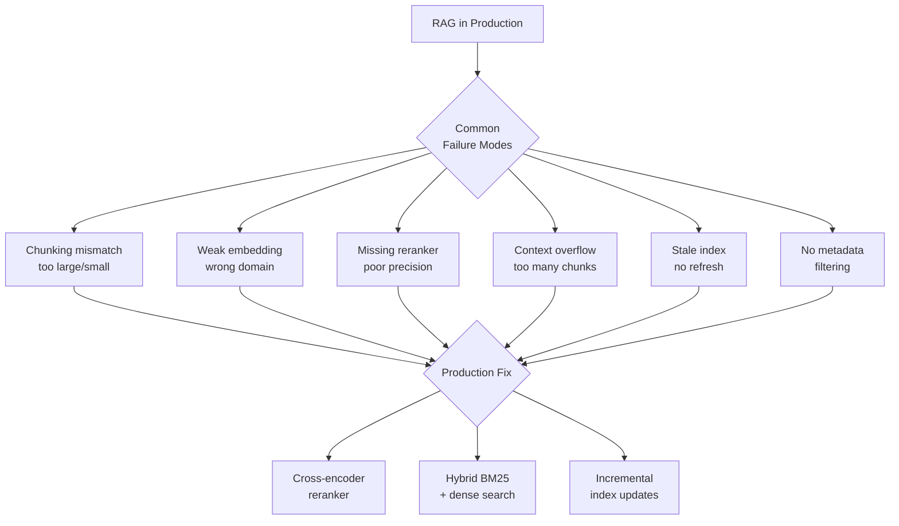

A RAG demo is easy to build. You split a PDF into chunks, embed them, store in a vector database, and retrieve the top-3 chunks when a user asks a question. It works beautifully in the demo. Then you ship it to users — and it falls apart.

This is the pattern. The gap between a RAG demo and a production RAG system is wide, and the failures are predictable. After building multiple RAG pipelines that serve real users on proprietary knowledge bases, here are the exact places they break — and how to fix them.

## Failure #1: Naive Chunking Destroys Context

The default approach: split documents into fixed-size chunks of 512 or 1000 characters, embed each chunk, store it. This seems reasonable until you look at what happens to your content:

```
Original text (product documentation):
"The authentication timeout is configurable via the AUTH_TIMEOUT environment 
variable. The default value is 3600 seconds. This can be overridden per-tenant
using the /api/admin/config endpoint. Note: values below 300 seconds are not 
supported and will be silently reset to 300."

After 512-char chunking with overlap=0:
Chunk 1: "The authentication timeout is configurable via the AUTH_TIMEOUT 
environment variable. The default value is 3600 seconds. This can be overridden 
per-tenant using the /api/admin"
Chunk 2: "/config endpoint. Note: values below 300 seconds are not supported 
and will be silently reset to 300."
```

A user asks: "What's the minimum allowed auth timeout?" Chunk 2 contains the answer — but it starts with `/config endpoint` with no context for what this belongs to. The embedding for this chunk doesn't capture "authentication timeout" because that phrase doesn't appear in the chunk.

**The fix: structure-aware chunking**

```python
from langchain.text_splitter import RecursiveCharacterTextSplitter, MarkdownHeaderTextSplitter

# For markdown/structured docs: split by headers first, then by size
header_splitter = MarkdownHeaderTextSplitter(
    headers_to_split_on=[
        ("#", "h1"),
        ("##", "h2"),
        ("###", "h3"),
    ]
)

# Second stage: split large sections that exceeded token limits
text_splitter = RecursiveCharacterTextSplitter(
    chunk_size=1000,
    chunk_overlap=200,  # Overlap preserves context at boundaries
    separators=["\n\n", "\n", ". ", " ", ""],
)

def split_document(content: str, metadata: dict) -> list:
    # Stage 1: respect document structure
    header_splits = header_splitter.split_text(content)
    
    # Stage 2: split large sections, preserving header metadata
    chunks = []
    for doc in header_splits:
        if len(doc.page_content) > 1200:
            sub_chunks = text_splitter.split_documents([doc])
            chunks.extend(sub_chunks)
        else:
            chunks.append(doc)
    
    # Add source metadata to every chunk
    for chunk in chunks:
        chunk.metadata.update(metadata)
    
    return chunks
```

## Failure #2: No Re-Ranking

Your vector search returns the top-K most semantically similar chunks. Semantic similarity is not the same as relevance. A chunk can be highly similar to the query without actually answering it.

**Example:**
Query: "How do I reset my API key?"
Retrieves: A chunk about "API key security best practices" (high similarity) instead of "Resetting your API key" (the actual answer, lower vector similarity because it uses different vocabulary).

The fix: add a cross-encoder re-ranker as a second pass:

```python
from sentence_transformers import CrossEncoder
from langchain_qdrant import QdrantVectorStore

cross_encoder = CrossEncoder("cross-encoder/ms-marco-MiniLM-L-6-v2")

def retrieve_with_rerank(query: str, vector_store: QdrantVectorStore, 
                          top_k_retrieve: int = 20, top_k_return: int = 5) -> list:
    # Step 1: broad retrieval (get more candidates than you need)
    candidates = vector_store.similarity_search(query, k=top_k_retrieve)
    
    # Step 2: re-rank with cross-encoder (much more accurate, but slower)
    pairs = [(query, doc.page_content) for doc in candidates]
    scores = cross_encoder.predict(pairs)
    
    # Step 3: return top-k by re-rank score
    ranked = sorted(zip(scores, candidates), reverse=True)
    return [doc for _, doc in ranked[:top_k_return]]
```

The cross-encoder sees both the query and the candidate together — it understands the relationship between them, not just their individual embeddings. Accuracy improves significantly, especially for precise factual questions.

## Failure #3: The "Lost in the Middle" Problem

Research by Liu et al. (2023) showed that LLMs perform worst on information positioned in the middle of a long context window. If you retrieve 10 chunks and pass them all to the LLM, the chunks in positions 3-7 are likely to be ignored.

**Evidence in practice**: your retrieval finds the right document, your faithfulness score is low, and users report the answer was incomplete. The relevant information was in chunk 5 of 10.

The fix: limit context and put the most relevant chunks at the start and end:

```python
def build_context(ranked_docs: list, max_chunks: int = 5, max_tokens: int = 3000) -> str:
    # Don't pass all retrieved chunks — limit to the most relevant
    top_docs = ranked_docs[:max_chunks]
    
    # Most relevant chunk goes first (highest attention from LLM)
    # Second most relevant goes last
    # Middle chunks get less attention — put lower-quality ones there
    if len(top_docs) > 2:
        reordered = [top_docs[0]] + top_docs[2:] + [top_docs[1]]
    else:
        reordered = top_docs
    
    context_parts = []
    total_tokens = 0
    
    for i, doc in enumerate(reordered, 1):
        chunk_text = f"[Source {i}: {doc.metadata.get('title', 'Unknown')}]\n{doc.page_content}"
        chunk_tokens = len(chunk_text.split()) * 1.3  # Rough token estimate
        
        if total_tokens + chunk_tokens > max_tokens:
            break
        
        context_parts.append(chunk_text)
        total_tokens += chunk_tokens
    
    return "\n\n---\n\n".join(context_parts)
```

## Failure #4: Wrong Embedding Model for Your Domain

The default choice — `all-MiniLM-L6-v2` or OpenAI `text-embedding-ada-002` — works well for general content. But for domain-specific technical content (product documentation, legal text, medical records), a model tuned to your domain significantly outperforms a general model.

A general embedding model may not understand that "cold standby" and "passive node" are synonyms in your storage product's documentation. A search for one won't retrieve the other.

**Signals that you have an embedding model mismatch:**
- Retrieval finds chunks that are semantically similar in general language but miss the exact domain terminology
- Users report that "it doesn't know what [technical term] means"
- Precision on your domain-specific test set is lower than expected

Test multiple models on your actual data before committing to one — more on this in the embedding models post.

## Failure #5: No Query Understanding

Users don't phrase questions the way documentation is written. Users ask: "why is my login failing?" Documentation says: "Authentication Error Codes and Troubleshooting."

If you embed the user's raw query and search, you may miss highly relevant content because the vocabulary doesn't overlap.

The fix: query expansion and HyDE (Hypothetical Document Embeddings):

```python
from langchain_anthropic import ChatAnthropic
from langchain_core.prompts import ChatPromptTemplate

llm = ChatAnthropic(model="claude-sonnet-4-6", temperature=0)

def expand_query(user_query: str) -> list[str]:
    """Generate multiple query variants to improve retrieval coverage."""
    prompt = ChatPromptTemplate.from_template("""
    Generate 3 alternative phrasings of this question that might better match 
    technical documentation:
    
    Original: {query}
    
    Return only the 3 alternatives, one per line. No numbering or explanation.
    """)
    
    response = llm.invoke(prompt.format_messages(query=user_query))
    variants = [line.strip() for line in response.content.strip().split("\n") if line.strip()]
    return [user_query] + variants[:3]

def hyde_retrieval(query: str, vector_store, k: int = 10) -> list:
    """HyDE: embed a hypothetical answer instead of the question."""
    
    # Generate a hypothetical answer document
    hypothetical_prompt = f"""Write a technical documentation excerpt that would answer: {query}
    
    Write it as if from an actual product documentation page. 2-3 sentences."""
    
    hypothetical_doc = llm.invoke(hypothetical_prompt).content
    
    # Retrieve using the hypothetical document's embedding
    # (better matches documentation style than a question embedding)
    return vector_store.similarity_search(hypothetical_doc, k=k)

def multi_query_retrieval(query: str, vector_store, k: int = 5) -> list:
    """Run multiple query variants and deduplicate results."""
    variants = expand_query(query)
    seen_ids = set()
    all_docs = []
    
    for variant in variants:
        docs = vector_store.similarity_search(variant, k=k)
        for doc in docs:
            doc_id = doc.metadata.get("chunk_id") or hash(doc.page_content)
            if doc_id not in seen_ids:
                seen_ids.add(doc_id)
                all_docs.append(doc)
    
    return all_docs
```

## Failure #6: Missing Source Attribution

Users don't just need the answer — they need to know where it came from so they can verify it and find related information. Without source attribution, users can't build trust in the system.

Every chunk must carry metadata from the moment of ingestion:

```python
def ingest_document(file_path: str, source_metadata: dict) -> list:
    """Ingest a document with full provenance metadata on every chunk."""
    loader = UnstructuredFileLoader(file_path)
    docs = loader.load()
    
    chunks = split_document(docs[0].page_content, metadata={
        "source_file": file_path,
        "source_title": source_metadata["title"],
        "source_url": source_metadata.get("url"),
        "version": source_metadata.get("version"),
        "last_updated": source_metadata.get("last_updated"),
        "content_type": source_metadata.get("content_type", "documentation"),
    })
    
    # Add chunk-level identifiers
    for i, chunk in enumerate(chunks):
        chunk.metadata["chunk_id"] = f"{source_metadata['id']}_chunk_{i}"
        chunk.metadata["chunk_index"] = i
        chunk.metadata["total_chunks"] = len(chunks)
    
    return chunks

def format_answer_with_citations(answer: str, source_docs: list) -> dict:
    """Return answer with structured source citations."""
    sources = []
    seen = set()
    for doc in source_docs:
        source_key = doc.metadata.get("source_title", doc.metadata.get("source_file", "Unknown"))
        if source_key not in seen:
            seen.add(source_key)
            sources.append({
                "title": source_key,
                "url": doc.metadata.get("source_url"),
                "version": doc.metadata.get("version"),
            })
    
    return {"answer": answer, "sources": sources}
```

## The Production RAG Checklist

Before shipping a RAG system, verify:

```
Ingestion:
[ ] Structure-aware chunking (not fixed-size splitting)
[ ] Chunk overlap of 10-20%
[ ] Full metadata on every chunk (source, title, version, URL)
[ ] Ingestion tested on edge cases (empty docs, tables, code blocks)

Retrieval:
[ ] Cross-encoder re-ranking as a second pass
[ ] Context limited to 4-6 chunks (lost-in-the-middle mitigation)
[ ] Query expansion or HyDE for low-vocabulary-overlap queries
[ ] Retrieval tested against a golden dataset

Generation:
[ ] System prompt instructs model to cite sources
[ ] System prompt instructs model to say "I don't know" when context doesn't contain the answer
[ ] Faithfulness score > 0.80 on eval dataset

Evaluation:
[ ] RAGAS or equivalent evaluation on 50+ question/answer pairs
[ ] Baseline faithfulness, relevancy, and recall tracked before shipping
[ ] Regression eval runs on each major change
```

## Key Takeaways

1. **Chunking is the highest-leverage optimization** — bad chunks ruin retrieval regardless of model quality
2. **Re-rank after retrieval** — a cross-encoder dramatically improves precision at minimal latency cost
3. **Limit context to 4-6 chunks** — more context reduces answer quality due to the lost-in-the-middle effect
4. **Query expansion compensates for vocabulary mismatch** — users and docs don't use the same words
5. **Source attribution is not optional** — users need to verify and trust answers

---

*Part of the [RAG Systems That Actually Work series]({{ site.baseurl }}/tags/rag-series/) — production lessons from building RAG pipelines on proprietary knowledge bases.*


## ## RAG Production Failure Modes


