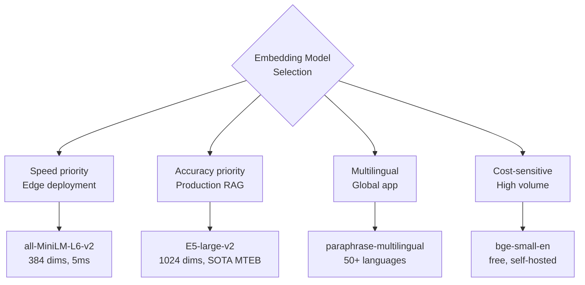

Every RAG pipeline relies on an embedding model to convert text into vectors. The model you choose directly determines the quality of your retrieval — and poor retrieval can't be fixed by a better LLM.

After using E5-Base-v2, all-MiniLM-L6-v2, and OpenAI's embeddings in production systems, here's what actually matters when making this choice — and how to benchmark for your specific use case.

## What Embeddings Do in a RAG Pipeline

The embedding model runs twice:

1. **At indexing time**: each document chunk → vector → stored in vector DB
2. **At query time**: user's question → vector → similarity search against stored vectors

The model must be the **same** at both stages. This is the rule that's easiest to forget and hardest to recover from — if you re-embed your documents with a different model, every stored vector becomes useless.

## The Three Models Worth Knowing

### all-MiniLM-L6-v2

The default choice for many tutorials, and for good reason — it's small, fast, and free.

```python
from sentence_transformers import SentenceTransformer
import time

model = SentenceTransformer("sentence-transformers/all-MiniLM-L6-v2")

# Characteristics
print(f"Embedding dimension: {model.get_sentence_embedding_dimension()}")  # 384
print(f"Max sequence length: {model.max_seq_length}")  # 256 tokens

# Speed benchmark
texts = ["Sample text for benchmarking"] * 1000
start = time.time()
embeddings = model.encode(texts, batch_size=64, show_progress_bar=False)
elapsed = time.time() - start
print(f"1000 texts in {elapsed:.2f}s ({1000/elapsed:.0f} texts/sec)")

# Symmetric use case (both query and passage are similar length/style)
query = "how to configure authentication timeout"
docs = [
    "Set AUTH_TIMEOUT environment variable to configure session duration",
    "Authentication tokens expire after the configured timeout period",
    "User login sessions are managed via the session service",
]

query_emb = model.encode(query, normalize_embeddings=True)
doc_embs = model.encode(docs, normalize_embeddings=True)

similarities = doc_embs @ query_emb  # Dot product of normalized vectors = cosine similarity
print(similarities)  # [0.71, 0.68, 0.42]
```

**Specs:**
- Dimension: 384
- Max tokens: 256
- Speed: ~10,000 sentences/sec on GPU, ~1,000 on CPU
- MTEB score: 56.26 (good general performance)
- Cost: Free (runs locally)
- Model size: 80MB

**Best for**: High-throughput applications where cost matters, symmetric tasks (question-answer pairs where both sides are similar length/style), prototyping.

**Weakness**: 256 token limit is low for long documents — chunks longer than this are truncated. General vocabulary — may miss domain-specific terminology.

---

### intfloat/e5-base-v2

E5 (Embeddings from Bidirectional Encoder Representations) was designed specifically for asymmetric retrieval: short questions retrieving long passages. It's the model I reach for first on enterprise document search.

```python
from sentence_transformers import SentenceTransformer

model = SentenceTransformer("intfloat/e5-base-v2")

print(f"Embedding dimension: {model.get_sentence_embedding_dimension()}")  # 768
print(f"Max sequence length: {model.max_seq_length}")  # 512 tokens

# Critical: E5 requires task prefixes
# Use "query: " for questions/searches
# Use "passage: " for documents being indexed
def encode_query(text: str) -> list:
    return model.encode(f"query: {text}", normalize_embeddings=True).tolist()

def encode_passage(text: str) -> list:
    return model.encode(f"passage: {text}", normalize_embeddings=True).tolist()

# WRONG — don't embed without prefixes
wrong_query_emb = model.encode("how to configure authentication timeout")  

# RIGHT — use prefixes for correct performance
correct_query_emb = encode_query("how to configure authentication timeout")
passage_emb = encode_passage("Set AUTH_TIMEOUT environment variable to configure session duration")

# E5 is specifically designed for asymmetric retrieval
# Short query ↔ Long passage works better than MiniLM
long_passage = """
The authentication system supports configurable session timeouts at both the 
global and per-tenant level. The global timeout is set via the AUTH_TIMEOUT 
environment variable and defaults to 3600 seconds (1 hour). Individual tenants 
can override this using the /api/v2/admin/settings endpoint with the 
session_timeout_seconds parameter. The minimum allowed value is 300 seconds; 
values below this threshold are silently normalized to 300 seconds.
"""

score = encode_query("what is the minimum auth timeout") @ encode_passage(long_passage)
print(f"Relevance score: {score:.3f}")  # Typically 0.75+ for relevant passages
```

**Specs:**
- Dimension: 768
- Max tokens: 512
- Speed: ~3,000 passages/sec on GPU (2x slower than MiniLM due to larger dimension)
- MTEB score: 61.5 (notably better than MiniLM)
- Cost: Free (runs locally)
- Model size: 438MB

**Best for**: Enterprise document search, technical documentation Q&A, any asymmetric retrieval where short questions need to match long passages. The prefix-based design is specifically tuned for this.

**E5 variants to know:**
- `e5-small-v2` (33M params) — fastest, good for real-time applications
- `e5-base-v2` (109M params) — best quality/speed tradeoff
- `e5-large-v2` (335M params) — best quality, 3x slower
- `multilingual-e5-base` — for non-English or mixed-language content

---

### OpenAI text-embedding-3-small and text-embedding-3-large

OpenAI's hosted embeddings offer the highest out-of-the-box quality, especially on diverse and general content. The tradeoff: API cost and latency.

```python
from openai import OpenAI
import numpy as np

client = OpenAI()  # Uses OPENAI_API_KEY env var

def embed_texts_openai(texts: list[str], model: str = "text-embedding-3-small") -> list[list[float]]:
    """Batch embed texts. OpenAI API accepts up to 2048 texts per request."""
    # Process in batches if needed
    batch_size = 100
    all_embeddings = []
    
    for i in range(0, len(texts), batch_size):
        batch = texts[i:i + batch_size]
        response = client.embeddings.create(
            input=batch,
            model=model,
        )
        batch_embeddings = [item.embedding for item in response.data]
        all_embeddings.extend(batch_embeddings)
    
    return all_embeddings

# text-embedding-3-small: dimension 1536 (can be reduced)
# text-embedding-3-large: dimension 3072 (can be reduced)

# Matryoshka representation: you can truncate the embedding dimension
# and still get good results — useful for memory/cost optimization
def embed_with_dimension_reduction(texts: list[str], dimensions: int = 256) -> list[list[float]]:
    """Use OpenAI's native dimension reduction (Matryoshka embeddings)."""
    response = client.embeddings.create(
        input=texts,
        model="text-embedding-3-large",
        dimensions=dimensions  # Supported: 256, 1024, 3072 for large
    )
    return [item.embedding for item in response.data]

# Cost calculation
def estimate_embedding_cost(num_documents: int, avg_tokens_per_doc: int, model: str) -> dict:
    total_tokens = num_documents * avg_tokens_per_doc
    prices = {
        "text-embedding-3-small": 0.02 / 1_000_000,  # $0.02 per 1M tokens
        "text-embedding-3-large": 0.13 / 1_000_000,  # $0.13 per 1M tokens
        "text-embedding-ada-002": 0.10 / 1_000_000,  # Legacy, avoid for new projects
    }
    price_per_token = prices.get(model, 0)
    total_cost = total_tokens * price_per_token
    
    return {
        "total_tokens": total_tokens,
        "estimated_cost_usd": round(total_cost, 4),
        "model": model
    }

# 10,000 documents, 500 tokens each
print(estimate_embedding_cost(10_000, 500, "text-embedding-3-small"))
# {'total_tokens': 5000000, 'estimated_cost_usd': 0.1, 'model': 'text-embedding-3-small'}
```

**Specs (text-embedding-3-small):**
- Dimension: 1536 (reducible to 256 or 512)
- Max tokens: 8191
- Speed: API latency ~100-300ms per batch
- MTEB score: 62.3 (highest among these three)
- Cost: $0.02/1M tokens

**Best for**: Highest accuracy requirement, very long documents (8K token context), or when you want to avoid managing model infrastructure.

**Avoid when**: You're indexing millions of documents frequently (cost scales), you need real-time embedding with sub-50ms latency, or air-gapped/on-premise deployment is required.

---

## The Critical Rule: Consistency

> The model used to encode your stored documents must be identical to the model used to encode queries at search time.

Mixing models produces completely random results. The vectors live in different geometric spaces — similarity between them is meaningless.

```python
# BAD: will produce garbage retrieval results
# Indexed with: SentenceTransformer("all-MiniLM-L6-v2")
# Querying with: client.embeddings.create(model="text-embedding-3-small")

# GOOD: consistent model throughout
class RAGPipeline:
    def __init__(self, model_name: str = "intfloat/e5-base-v2"):
        self.model_name = model_name  # Store this
        self.model = SentenceTransformer(model_name)
    
    def index_documents(self, documents: list[str]) -> list[list[float]]:
        return self.model.encode(
            [f"passage: {d}" for d in documents],
            normalize_embeddings=True
        ).tolist()
    
    def encode_query(self, query: str) -> list[float]:
        return self.model.encode(
            f"query: {query}",
            normalize_embeddings=True
        ).tolist()
    
    def save_config(self, path: str):
        """Persist model choice so it can't drift."""
        import json
        with open(f"{path}/embedding_config.json", "w") as f:
            json.dump({"model_name": self.model_name}, f)
    
    @classmethod
    def load(cls, path: str) -> "RAGPipeline":
        import json
        with open(f"{path}/embedding_config.json") as f:
            config = json.load(f)
        return cls(model_name=config["model_name"])
```

Always persist your model configuration alongside your vector index.

---

## How to Benchmark for Your Specific Data

MTEB scores are measured on general benchmark datasets — they don't guarantee performance on your domain-specific content. Run your own benchmark before committing.

```python
from sentence_transformers import SentenceTransformer
from sklearn.metrics.pairwise import cosine_similarity
import numpy as np

# Your golden test set: questions with known relevant documents
TEST_CASES = [
    {
        "query": "What is the default session timeout?",
        "relevant_doc_ids": ["auth-config-001", "session-management-003"],
    },
    {
        "query": "How do I configure rate limiting?",
        "relevant_doc_ids": ["api-rate-limiting-001"],
    },
    # Add 30-50 test cases for a reliable benchmark
]

def benchmark_model(model_name: str, documents: dict, test_cases: list, k: int = 5) -> dict:
    """Measure Recall@K for a given embedding model on your dataset."""
    is_e5 = "e5" in model_name.lower()
    model = SentenceTransformer(model_name)
    
    doc_ids = list(documents.keys())
    doc_texts = list(documents.values())
    
    # Encode documents
    if is_e5:
        doc_texts = [f"passage: {t}" for t in doc_texts]
    doc_embeddings = model.encode(doc_texts, normalize_embeddings=True, batch_size=64)
    
    recalls = []
    for case in test_cases:
        query_text = f"query: {case['query']}" if is_e5 else case["query"]
        query_emb = model.encode(query_text, normalize_embeddings=True)
        
        similarities = cosine_similarity([query_emb], doc_embeddings)[0]
        top_k_indices = np.argsort(similarities)[::-1][:k]
        top_k_ids = [doc_ids[i] for i in top_k_indices]
        
        # Recall@K: fraction of relevant docs found in top-K results
        relevant = set(case["relevant_doc_ids"])
        retrieved = set(top_k_ids)
        recall = len(relevant & retrieved) / len(relevant)
        recalls.append(recall)
    
    return {
        "model": model_name,
        "recall_at_5": round(np.mean(recalls), 3),
        "dimension": model.get_sentence_embedding_dimension(),
        "max_tokens": model.max_seq_length,
    }

# Compare models on your actual data
models_to_test = [
    "sentence-transformers/all-MiniLM-L6-v2",
    "intfloat/e5-base-v2",
    "intfloat/e5-small-v2",
]

for model_name in models_to_test:
    result = benchmark_model(model_name, your_documents, TEST_CASES)
    print(f"{result['model']}: Recall@5={result['recall_at_5']}, dim={result['dimension']}")
```

---

## Summary: Which to Choose

| Situation | Recommended Model |
|---|---|
| Prototyping, general content | `all-MiniLM-L6-v2` |
| Production, technical docs | `intfloat/e5-base-v2` |
| Production, multilingual | `intfloat/multilingual-e5-base` |
| Best accuracy, budget available | `text-embedding-3-small` (OpenAI) |
| Long documents (> 512 tokens) | `text-embedding-3-small` (8K context) |
| On-premise / air-gapped | `e5-base-v2` or `e5-large-v2` |
| Real-time, low latency | `e5-small-v2` or `all-MiniLM-L6-v2` |

## Key Takeaways

1. **Use the same model at indexing and query time** — this is non-negotiable
2. **E5-base-v2 is the best free default for asymmetric retrieval** — short questions, long passages
3. **E5 requires task prefixes** — `"query: "` and `"passage: "` prefixes are mandatory
4. **MiniLM is for speed, E5 is for accuracy, OpenAI is for maximum quality**
5. **Always benchmark on your own data** — MTEB scores don't predict domain-specific performance
6. **Persist your model config** — it's as important as persisting the vector index

---

*Part of the [RAG Systems That Actually Work series]({{ site.baseurl }}/tags/rag-series/) — production lessons from building RAG pipelines on proprietary knowledge bases.*


## ## Embedding Model Trade-offs


