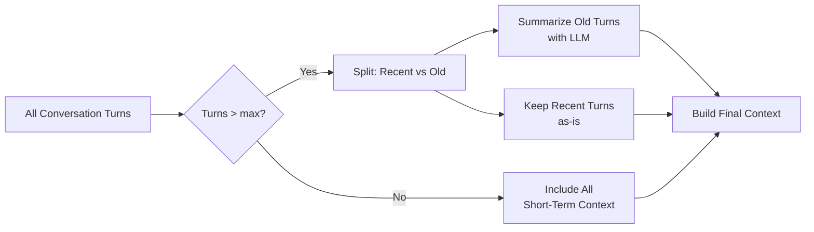

Single-turn RAG is straightforward: user asks a question, retrieve relevant chunks, generate an answer. Multi-turn RAG — where users follow up on previous answers, reference earlier context, and expect the system to maintain coherent conversation state — is substantially harder.

The naive multi-turn approach breaks immediately:

```
User: "What is the default authentication timeout?"
System: "The default auth timeout is 3600 seconds."

User: "Can I change it?"
System: [Searches for "Can I change it?" → finds nothing relevant → hallucinates or fails]
```

"Can I change it?" contains no meaningful search terms without the previous context. Building multi-turn RAG that handles this correctly requires solving three separate problems: query rewriting, conversation memory, and context windowing.

## Problem 1: Coreference and Context-Dependent Queries

User follow-up questions routinely use pronouns and references that only make sense in context:
- "it", "this", "that" → refer to something mentioned earlier
- "the one I mentioned" → implicit reference
- "what about version 2?" → refers to a feature discussed two turns ago
- "and for the admin user?" → inherits the topic from previous turns

The fix is **query rewriting**: before searching, use the LLM to rewrite the user's latest question into a standalone, self-contained query.

```python
from langchain_anthropic import ChatAnthropic
from langchain_core.prompts import ChatPromptTemplate
from langchain_core.messages import HumanMessage, AIMessage

llm = ChatAnthropic(model="claude-sonnet-4-6", temperature=0)

QUERY_REWRITE_PROMPT = ChatPromptTemplate.from_messages([
    ("system", """You are a search query optimizer. Given a conversation history and a follow-up question, 
    rewrite the follow-up question to be a complete, standalone search query that captures all necessary 
    context from the conversation.
    
    Rules:
    - Replace pronouns (it, this, they) with the specific entity they refer to
    - Include relevant technical context from earlier in the conversation
    - Keep the query concise — one or two sentences maximum
    - If the question is already standalone, return it unchanged
    - Return ONLY the rewritten query, nothing else"""),
    ("human", """Conversation history:
{history}

Follow-up question: {question}

Rewritten standalone query:""")
])

def rewrite_query(question: str, conversation_history: list) -> str:
    """Rewrite a context-dependent question into a standalone search query."""
    if not conversation_history:
        return question  # First turn — no rewriting needed
    
    # Format history as readable text
    history_text = ""
    for msg in conversation_history[-6:]:  # Last 3 turns (6 messages)
        role = "User" if isinstance(msg, HumanMessage) else "Assistant"
        history_text += f"{role}: {msg.content[:300]}\n"
    
    response = llm.invoke(
        QUERY_REWRITE_PROMPT.format_messages(
            history=history_text,
            question=question
        )
    )
    return response.content.strip()

# Example
history = [
    HumanMessage(content="What is the default authentication timeout?"),
    AIMessage(content="The default authentication timeout is 3600 seconds (1 hour), configured via AUTH_TIMEOUT."),
]

original = "Can I change it per tenant?"
rewritten = rewrite_query(original, history)
print(rewritten)
# → "Can the authentication timeout (AUTH_TIMEOUT) be configured differently per tenant?"
```

## Problem 2: Conversation Memory Architecture

Multi-turn RAG needs two types of memory:

**Short-term memory**: The current conversation — what was said in this session. This fits in the LLM context window.

**Long-term memory**: Relevant past interactions — what the user has asked about before across multiple sessions. This requires a separate vector store.

```python
from dataclasses import dataclass, field
from typing import Optional
import json
from datetime import datetime
from langchain_qdrant import QdrantVectorStore
from qdrant_client import QdrantClient

@dataclass
class ConversationTurn:
    user_message: str
    assistant_response: str
    retrieved_sources: list[str]
    query_used: str  # The rewritten query that was actually searched
    timestamp: str = field(default_factory=lambda: datetime.utcnow().isoformat())

class ConversationMemory:
    """Manages short-term (in-context) and long-term (vector) memory."""
    
    def __init__(
        self,
        session_id: str,
        vector_store: QdrantVectorStore,
        max_short_term_turns: int = 10,
    ):
        self.session_id = session_id
        self.vector_store = vector_store
        self.max_short_term_turns = max_short_term_turns
        self.turns: list[ConversationTurn] = []
    
    def add_turn(self, turn: ConversationTurn):
        """Add a completed conversation turn to memory."""
        self.turns.append(turn)
        
        # Persist to long-term memory (vector store)
        memory_text = (
            f"User asked: {turn.user_message}\n"
            f"System answered: {turn.assistant_response[:500]}"
        )
        self.vector_store.add_texts(
            texts=[memory_text],
            metadatas=[{
                "session_id": self.session_id,
                "type": "conversation_memory",
                "timestamp": turn.timestamp,
                "query": turn.query_used,
            }]
        )
    
    def get_short_term_context(self) -> list:
        """Get recent turns as LangChain message objects."""
        from langchain_core.messages import HumanMessage, AIMessage
        
        recent_turns = self.turns[-self.max_short_term_turns:]
        messages = []
        for turn in recent_turns:
            messages.append(HumanMessage(content=turn.user_message))
            messages.append(AIMessage(content=turn.assistant_response))
        return messages
    
    def retrieve_relevant_history(self, query: str, k: int = 3) -> list[str]:
        """Retrieve relevant past conversation snippets from long-term memory."""
        results = self.vector_store.similarity_search(
            query=query,
            k=k,
            filter={"type": "conversation_memory"}
        )
        return [doc.page_content for doc in results]
    
    def get_summary_if_needed(self, max_tokens: int = 2000) -> Optional[str]:
        """Summarize old conversation turns to stay within context limits."""
        if len(self.turns) <= self.max_short_term_turns:
            return None
        
        old_turns = self.turns[:-self.max_short_term_turns]
        summary_prompt = (
            "Summarize these conversation turns concisely, preserving key facts:\n\n"
            + "\n".join([f"Q: {t.user_message}\nA: {t.assistant_response[:200]}" for t in old_turns])
        )
        summary = llm.invoke(summary_prompt).content
        return summary
```

## Building the Multi-Turn RAG Pipeline

```python
from langchain_core.prompts import ChatPromptTemplate
from langchain_qdrant import QdrantVectorStore
from sentence_transformers import SentenceTransformer
from qdrant_client import QdrantClient

encoder = SentenceTransformer("intfloat/e5-base-v2")
qdrant = QdrantClient(url="http://localhost:6333")

knowledge_base = QdrantVectorStore(
    client=qdrant,
    collection_name="knowledge_base",
    embedding=lambda texts: encoder.encode(
        [f"passage: {t}" for t in texts], normalize_embeddings=True
    ).tolist()
)

SYSTEM_PROMPT = """You are a helpful technical support assistant. 
Answer questions based on the provided context. 

Rules:
- If the answer is in the context, answer accurately and cite the source
- If the answer is NOT in the context, say "I don't have information about that in my knowledge base"
- Keep answers concise and focused on what was asked
- When referring to previous parts of the conversation, be explicit about what you're referencing"""

def multi_turn_rag_response(
    user_message: str,
    memory: ConversationMemory,
    k_knowledge: int = 5,
    k_memory: int = 3,
) -> dict:
    
    # Step 1: Rewrite the query using conversation history
    short_term_history = memory.get_short_term_context()
    standalone_query = rewrite_query(user_message, short_term_history)
    
    # Step 2: Retrieve from knowledge base
    query_embedding = encoder.encode(f"query: {standalone_query}", normalize_embeddings=True).tolist()
    knowledge_docs = knowledge_base.similarity_search_by_vector(query_embedding, k=k_knowledge)
    
    # Step 3: Retrieve relevant conversation history (long-term memory)
    relevant_history = memory.retrieve_relevant_history(standalone_query, k=k_memory)
    
    # Step 4: Build context
    knowledge_context = "\n\n---\n\n".join([
        f"[{doc.metadata.get('title', 'Source')}]\n{doc.page_content}"
        for doc in knowledge_docs
    ])
    
    memory_context = ""
    if relevant_history:
        memory_context = "\n\n[From previous conversations]\n" + "\n".join(relevant_history)
    
    # Step 5: Build prompt with conversation history + retrieved context
    conversation_summary = memory.get_summary_if_needed()
    
    messages = [("system", SYSTEM_PROMPT)]
    
    if conversation_summary:
        messages.append(("human", f"[Earlier conversation summary: {conversation_summary}]"))
        messages.append(("ai", "Understood. I have that context."))
    
    # Add recent conversation turns
    for msg in short_term_history:
        from langchain_core.messages import HumanMessage, AIMessage
        if isinstance(msg, HumanMessage):
            messages.append(("human", msg.content))
        else:
            messages.append(("ai", msg.content))
    
    # Add current question with context
    messages.append(("human", f"""Context from knowledge base:
{knowledge_context}
{memory_context}

Question: {user_message}

(Note: this question was interpreted as: "{standalone_query}")"""))
    
    # Step 6: Generate response
    prompt = ChatPromptTemplate.from_messages(messages)
    response = llm.invoke(prompt.format_messages())
    
    # Step 7: Store in memory
    memory.add_turn(ConversationTurn(
        user_message=user_message,
        assistant_response=response.content,
        retrieved_sources=[doc.metadata.get("source", "") for doc in knowledge_docs],
        query_used=standalone_query,
    ))
    
    return {
        "answer": response.content,
        "rewritten_query": standalone_query,
        "sources": [doc.metadata.get("title", "Unknown") for doc in knowledge_docs],
        "used_memory": bool(relevant_history),
    }
```

## Usage Example

```python
from qdrant_client.models import Distance, VectorParams

# Initialize memory store
memory_store = QdrantVectorStore.from_existing_collection(
    url="http://localhost:6333",
    collection_name="conversation_memory",
    embedding=lambda texts: encoder.encode(texts, normalize_embeddings=True).tolist()
)

session_memory = ConversationMemory(
    session_id="user_123_session_456",
    vector_store=memory_store,
    max_short_term_turns=10,
)

# Simulated multi-turn conversation
exchanges = [
    "What is the default authentication timeout?",
    "Can I change it per tenant?",       # → "Can the auth timeout be configured per tenant?"
    "What's the minimum allowed value?",  # → "What is the minimum allowed value for auth timeout?"
    "And what happens if I set it lower than that?",  # → complex reference resolution
]

for user_msg in exchanges:
    print(f"\nUser: {user_msg}")
    result = multi_turn_rag_response(user_msg, session_memory)
    print(f"[Query used: {result['rewritten_query']}]")
    print(f"Assistant: {result['answer'][:300]}")
    print(f"Sources: {result['sources']}")
```

## Handling the Token Budget

Long conversations grow unboundedly. You need a strategy for managing the context window:



```python
def build_conversation_context(
    memory: ConversationMemory,
    max_recent_turns: int = 6,
    summarize_older: bool = True
) -> tuple[str, list]:
    """
    Returns a (summary_str, recent_messages) tuple for prompt construction.
    Recent messages are LangChain message objects for use in the prompt.
    """
    all_turns = memory.turns
    
    if len(all_turns) <= max_recent_turns:
        return "", memory.get_short_term_context()
    
    # Summarize older turns
    old_turns = all_turns[:-max_recent_turns]
    recent_turns = all_turns[-max_recent_turns:]
    
    if summarize_older:
        old_content = "\n".join([
            f"Q: {t.user_message}\nA: {t.assistant_response[:300]}"
            for t in old_turns
        ])
        summary_prompt = (
            "Summarize this technical support conversation concisely. "
            "Keep: key facts established, user's topic area, any decisions made.\n\n" + old_content
        )
        summary = llm.invoke(summary_prompt).content
    else:
        summary = f"[{len(old_turns)} earlier turns not shown]"
    
    # Recent turns as proper message objects
    recent_messages = []
    from langchain_core.messages import HumanMessage, AIMessage
    for turn in recent_turns:
        recent_messages.append(HumanMessage(content=turn.user_message))
        recent_messages.append(AIMessage(content=turn.assistant_response))
    
    return summary, recent_messages
```

## Key Takeaways

1. **Query rewriting is mandatory for multi-turn RAG** — raw follow-up questions fail retrieval
2. **Maintain both short-term and long-term memory** — recent turns in context, older turns in vector store
3. **Use LLM summarization to manage token budgets** — don't just truncate old turns
4. **Log the rewritten query** — it's the most useful debugging signal in multi-turn systems
5. **Test conversation flows explicitly** — single-turn evals don't catch multi-turn failures

---

*Part of the [RAG Systems That Actually Work series]({{ site.baseurl }}/tags/rag-series/) — production lessons from building RAG pipelines on proprietary knowledge bases.*
