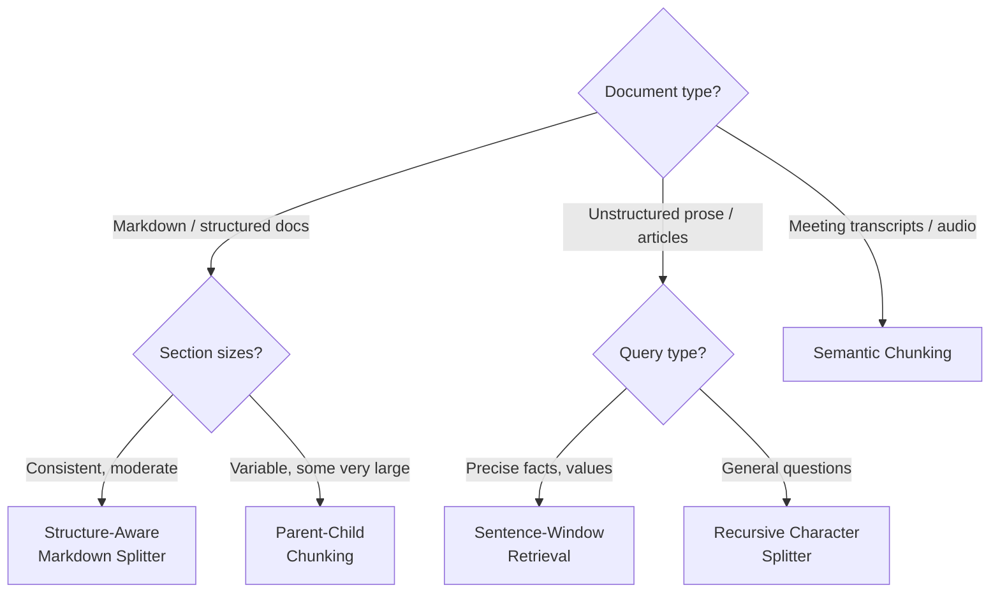

If you can only optimize one thing in your RAG pipeline, optimize chunking. The quality of your retrieval — and therefore the quality of your answers — depends more on how you split documents than on which embedding model or vector database you use.

Bad chunks destroy context. Good chunks make retrieval precise and answers accurate.

This post covers six chunking strategies — from naive to production-grade — with code for each. The strategy you choose depends on your document type, query patterns, and latency requirements.

## Why Chunking is the Highest-Leverage Optimization

Here's what happens with naive chunking:

```
Document: "The AUTH_TIMEOUT setting controls session duration. 
The default is 3600 seconds. To configure per tenant, use the 
/admin/settings API endpoint with the session_timeout field."

Chunk 1 (first 150 chars): "The AUTH_TIMEOUT setting controls session 
duration. The default is 3600 seconds. To configure per"

Chunk 2 (next 150 chars): " tenant, use the /admin/settings API endpoint 
with the session_timeout field."
```

User asks: "How do I configure auth timeout per tenant?"

Chunk 2 contains the answer — but starts with "tenant, use the" which has no context. Its embedding doesn't capture "AUTH_TIMEOUT" or "configure" or "session" — all of which are in chunk 1. The retrieval fails.

Good chunking keeps semantically related content together.

## Strategy 1: Fixed-Size Chunking (Baseline)

The simplest approach. Split every N characters with an overlap.

```python
from langchain.text_splitter import CharacterTextSplitter

splitter = CharacterTextSplitter(
    chunk_size=1000,      # Characters per chunk
    chunk_overlap=200,    # Overlap between consecutive chunks
    separator="\n",       # Try to split on newlines first
)

chunks = splitter.create_documents(
    texts=[document_content],
    metadatas=[{"source": "docs/auth.md", "title": "Authentication Guide"}]
)

print(f"Created {len(chunks)} chunks")
print(f"Avg chunk size: {sum(len(c.page_content) for c in chunks) / len(chunks):.0f} chars")
```

**Use when**: You need a quick baseline. Every document type, no special handling.

**Weakness**: Splits mid-sentence, mid-table, mid-code-block. Overlap helps but doesn't solve context loss at boundaries.

---

## Strategy 2: Recursive Character Splitting (Better Default)

LangChain's `RecursiveCharacterTextSplitter` tries a hierarchy of separators, preferring to split on paragraph breaks before sentences, sentences before words. This preserves semantic units better than fixed-size splitting.

```python
from langchain.text_splitter import RecursiveCharacterTextSplitter

splitter = RecursiveCharacterTextSplitter(
    chunk_size=1000,
    chunk_overlap=200,
    # Try these separators in order — fall through to the next if chunk still too large
    separators=[
        "\n\n",      # Paragraph breaks (preferred)
        "\n",        # Line breaks
        ". ",        # Sentence boundaries
        ", ",        # Clause boundaries
        " ",         # Word boundaries (last resort)
        "",          # Character level (absolute last resort)
    ],
    length_function=len,
    is_separator_regex=False,
)

chunks = splitter.create_documents(
    texts=[document_content],
    metadatas=[{"source": "docs/auth.md"}]
)
```

This is the right default for most unstructured text. Use it unless you have a specific reason to do otherwise.

---

## Strategy 3: Structure-Aware Chunking (Best for Technical Docs)

Technical documentation has structure: headers, sections, subsections. Splitting at section boundaries preserves the natural semantic units far better than character-based approaches.

```python
from langchain.text_splitter import MarkdownHeaderTextSplitter, RecursiveCharacterTextSplitter

# Stage 1: Split by headers to respect document structure
header_splitter = MarkdownHeaderTextSplitter(
    headers_to_split_on=[
        ("#", "h1"),
        ("##", "h2"),
        ("###", "h3"),
    ],
    strip_headers=False,  # Keep headers in the chunk content — they add semantic signal
)

# Stage 2: For sections that are still too large, split recursively
text_splitter = RecursiveCharacterTextSplitter(
    chunk_size=1200,
    chunk_overlap=200,
)

def chunk_markdown_document(content: str, base_metadata: dict) -> list:
    # Split by structure
    header_chunks = header_splitter.split_text(content)
    
    final_chunks = []
    for chunk in header_chunks:
        if len(chunk.page_content) > 1400:
            # Section is too large — split further while preserving section metadata
            sub_chunks = text_splitter.split_documents([chunk])
            final_chunks.extend(sub_chunks)
        else:
            final_chunks.append(chunk)
    
    # Enrich metadata: add source info and section breadcrumb
    for i, chunk in enumerate(final_chunks):
        section = " > ".join(filter(None, [
            chunk.metadata.get("h1", ""),
            chunk.metadata.get("h2", ""),
            chunk.metadata.get("h3", ""),
        ]))
        chunk.metadata.update({
            **base_metadata,
            "section": section,
            "chunk_index": i,
        })
    
    return final_chunks

# Usage
chunks = chunk_markdown_document(
    content=markdown_content,
    base_metadata={
        "source": "docs/authentication.md",
        "title": "Authentication Guide",
        "version": "2.3",
    }
)

# Each chunk now carries its section context:
# chunk.metadata["section"] = "Authentication > Session Management > Per-Tenant Configuration"
```

The section breadcrumb in metadata is valuable — it can be prepended to the chunk content at query time to improve embedding quality.

---

## Strategy 4: Sentence-Window Retrieval

Store small chunks (sentences), but retrieve a wider window of surrounding context at query time. This gives you the precision of small-chunk retrieval with the context of larger chunks.

```python
from langchain.text_splitter import SentenceTransformersTokenTextSplitter
import json

# Split into sentence-level chunks
sentence_splitter = SentenceTransformersTokenTextSplitter(
    model_name="sentence-transformers/all-MiniLM-L6-v2",
    chunk_overlap=0,
    tokens_per_chunk=64,  # Small — roughly 1-2 sentences
)

def build_sentence_window_index(document: str, window_size: int = 3) -> list:
    """
    Index individual sentences, but attach a larger surrounding window
    as metadata to retrieve at query time.
    """
    sentences = sentence_splitter.split_text(document)
    
    chunks = []
    for i, sentence in enumerate(sentences):
        # The window: sentence + surrounding context
        window_start = max(0, i - window_size)
        window_end = min(len(sentences), i + window_size + 1)
        surrounding_context = " ".join(sentences[window_start:window_end])
        
        chunks.append({
            "sentence": sentence,           # What gets embedded (small, precise)
            "window_context": surrounding_context,  # What gets returned to the LLM (larger)
            "sentence_index": i,
            "window_start": window_start,
            "window_end": window_end,
        })
    
    return chunks

def retrieve_with_sentence_window(query: str, vector_store, k: int = 5) -> list[str]:
    """Retrieve by sentence match, return window context."""
    results = vector_store.similarity_search(query, k=k)
    
    # Return the window context, not just the matched sentence
    contexts = []
    for doc in results:
        window_context = doc.metadata.get("window_context", doc.page_content)
        source = doc.metadata.get("title", "Unknown")
        contexts.append(f"[{source}]\n{window_context}")
    
    return contexts
```

**Use when**: Precise point-in-time information needs (exact values, thresholds, error codes) where exact sentence matching is important but context around the sentence is needed for the LLM to answer well.

---

## Strategy 5: Parent-Child Chunking

Index small child chunks for precise retrieval, but return the full parent section to the LLM. This is a cleaner version of sentence-window retrieval with explicit parent-child relationships.

```python
from langchain.retrievers import ParentDocumentRetriever
from langchain.storage import InMemoryStore
from langchain_community.vectorstores import Qdrant
from langchain.text_splitter import RecursiveCharacterTextSplitter
from sentence_transformers import SentenceTransformer
from langchain_huggingface import HuggingFaceEmbeddings

# Parent splitter: larger chunks (what gets returned to the LLM)
parent_splitter = RecursiveCharacterTextSplitter(chunk_size=2000, chunk_overlap=0)

# Child splitter: smaller chunks (what gets embedded and searched)
child_splitter = RecursiveCharacterTextSplitter(chunk_size=400, chunk_overlap=50)

# Document store: holds the full parent documents
docstore = InMemoryStore()  # Use Redis or Postgres for production

# Vector store: holds the small child embeddings
embeddings = HuggingFaceEmbeddings(model_name="intfloat/e5-base-v2")
vectorstore = Qdrant(client=qdrant_client, collection_name="child_chunks", embeddings=embeddings)

# Build the retriever
retriever = ParentDocumentRetriever(
    vectorstore=vectorstore,
    docstore=docstore,
    child_splitter=child_splitter,
    parent_splitter=parent_splitter,
)

# Index documents — small chunks go to vector store, full sections to docstore
from langchain_core.documents import Document
docs = [Document(page_content=content, metadata={"source": "docs/auth.md"})]
retriever.add_documents(docs)

# At query time: retrieves child chunks, returns parent sections
relevant_sections = retriever.get_relevant_documents(
    "How do I configure authentication timeout per tenant?"
)
# Returns the full 2000-char parent section, not the 400-char child that matched
```

**Use when**: Your documents have clear hierarchical structure (chapters → sections → paragraphs) and you want precise matching but rich context.

---

## Strategy 6: Semantic Chunking

Split documents at natural semantic boundaries — places where the meaning shifts — rather than at character counts or syntactic boundaries. More expensive to compute, but produces the most semantically coherent chunks.

```python
from langchain_experimental.text_splitter import SemanticChunker
from langchain_huggingface import HuggingFaceEmbeddings

embeddings = HuggingFaceEmbeddings(model_name="sentence-transformers/all-MiniLM-L6-v2")

# SemanticChunker: embeds every sentence, then groups sentences where
# cosine similarity drops below a threshold into new chunks
chunker = SemanticChunker(
    embeddings=embeddings,
    breakpoint_threshold_type="percentile",  # Split at the top N% of semantic shifts
    breakpoint_threshold_amount=85,          # 85th percentile of cosine distance drops
)

chunks = chunker.create_documents([long_document])

# Each chunk contains sentences that belong semantically together
# The chunk boundaries align with topic shifts in the text
print(f"Semantic chunks created: {len(chunks)}")
for chunk in chunks[:3]:
    print(f"\n[{len(chunk.page_content)} chars]\n{chunk.page_content[:200]}")
```

**Use when**: Documents cover multiple topics without explicit header structure (meeting transcripts, research papers, long articles), and you're willing to pay the compute cost at indexing time.

**Weakness**: Slower to compute (embeds every sentence twice). Not appropriate for real-time ingestion.

---

## Choosing the Right Strategy



## Benchmarking Chunking Strategy

Always measure the impact of chunking changes on retrieval quality:

```python
def evaluate_chunking_strategy(strategy_name: str, chunks: list, test_cases: list) -> dict:
    """Evaluate a chunking strategy on a golden test set."""
    # Index chunks
    vector_store = index_chunks(chunks)
    
    recalls = []
    for case in test_cases:
        retrieved = vector_store.similarity_search(case["query"], k=5)
        retrieved_ids = {doc.metadata.get("chunk_id") for doc in retrieved}
        
        # Check if relevant content was retrieved
        relevant_retrieved = sum(
            1 for expected_phrase in case["expected_phrases"]
            if any(expected_phrase.lower() in doc.page_content.lower() for doc in retrieved)
        )
        recall = relevant_retrieved / len(case["expected_phrases"])
        recalls.append(recall)
    
    return {
        "strategy": strategy_name,
        "num_chunks": len(chunks),
        "avg_chunk_size": sum(len(c.page_content) for c in chunks) / len(chunks),
        "recall_at_5": round(sum(recalls) / len(recalls), 3),
    }

# Compare strategies on your documents
strategies = {
    "fixed_size": fixed_size_chunks,
    "recursive": recursive_chunks,
    "structure_aware": structure_aware_chunks,
    "parent_child": parent_child_chunks,
}

for name, chunks in strategies.items():
    result = evaluate_chunking_strategy(name, chunks, golden_test_cases)
    print(f"{name}: recall={result['recall_at_5']}, chunks={result['num_chunks']}, avg_size={result['avg_chunk_size']:.0f}")
```

## Key Takeaways

1. **Recursive character splitting is the right default** — better than fixed-size for almost every use case
2. **Structure-aware chunking is best for technical documentation** — respect section boundaries
3. **Parent-child retrieval gives you precision + context** — index small chunks, return large ones
4. **Sentence-window is best for precise factual retrieval** — exact values, error codes, thresholds
5. **Semantic chunking is best for unstructured content** — more expensive, but handles topic shifts well
6. **Always benchmark chunking strategy changes** — don't guess, measure Recall@K on your golden dataset

---

*Part of the [RAG Systems That Actually Work series]({{ site.baseurl }}/tags/rag-series/) — production lessons from building RAG pipelines on proprietary knowledge bases.*
