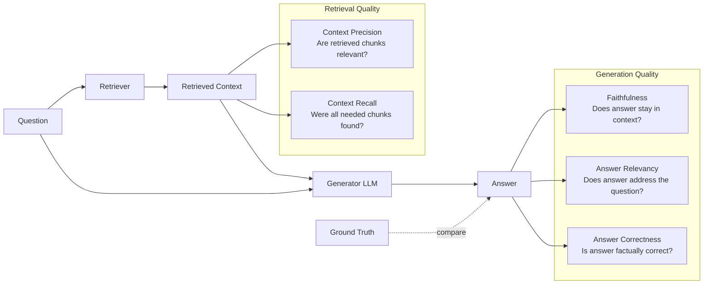

You can't improve what you can't measure. This is true everywhere in software engineering, but it's especially true in RAG systems — where the failure modes are subtle, user-facing, and hard to catch with traditional testing.

RAGAS (Retrieval Augmented Generation Assessment) is the standard framework for quantitatively evaluating RAG pipeline quality. After using it to measure and improve production RAG systems, here's how to use it effectively — not just to generate scores, but to drive actual improvements.

## What RAGAS Measures

RAGAS evaluates a RAG pipeline across four core dimensions:



| Metric | Question It Answers | Requires Ground Truth? |
|---|---|---|
| **Faithfulness** | Is the answer grounded in the retrieved context (no hallucination)? | No |
| **Answer Relevancy** | Does the answer actually address the question asked? | No |
| **Context Precision** | Are the retrieved chunks relevant to the question? | Yes |
| **Context Recall** | Did retrieval find all necessary information? | Yes |
| **Answer Correctness** | Is the answer factually correct vs. the known ground truth? | Yes |

Faithfulness and Answer Relevancy don't require ground truth — run them continuously in production. Context Precision, Recall, and Correctness require a curated golden dataset — run them periodically.

## Installation and Setup

```bash
pip install ragas langchain-anthropic langchain-openai datasets
```

```python
from ragas import evaluate
from ragas.metrics import (
    faithfulness,
    answer_relevancy,
    context_precision,
    context_recall,
    answer_correctness,
)
from ragas.llms import LangchainLLMWrapper
from ragas.embeddings import LangchainEmbeddingsWrapper
from langchain_anthropic import ChatAnthropic
from langchain_openai import OpenAIEmbeddings
from datasets import Dataset

# RAGAS uses LLM-as-judge internally — configure which LLM it uses
judge_llm = LangchainLLMWrapper(ChatAnthropic(model="claude-sonnet-4-6", temperature=0))
judge_embeddings = LangchainEmbeddingsWrapper(OpenAIEmbeddings(model="text-embedding-3-small"))
```

## Building Your Golden Dataset

The quality of your evaluation is entirely determined by the quality of your test cases. A weak golden dataset produces misleading scores.

**What makes a good test case:**
- Questions representative of real user queries (not adversarial edge cases)
- Ground truth written from the actual source documents
- Coverage across different question types (factual, procedural, comparative)

```python
# Golden dataset structure
GOLDEN_DATASET = [
    {
        "question": "What is the default authentication timeout?",
        "ground_truth": "The default authentication timeout is 3600 seconds (1 hour), "
                        "configurable via the AUTH_TIMEOUT environment variable.",
        "context_hint": ["auth-config", "session-management"],  # For building targeted test retrieval
    },
    {
        "question": "How do I configure rate limiting per API endpoint?",
        "ground_truth": "Rate limiting is configured per endpoint using the "
                        "X-RateLimit-Limit header in the response configuration. "
                        "Default is 1000 requests per minute per API key.",
        "context_hint": ["api-config", "rate-limiting"],
    },
    {
        "question": "What are the system requirements for the on-premise deployment?",
        "ground_truth": "On-premise deployment requires: 8 CPU cores, 32GB RAM minimum, "
                        "Ubuntu 20.04 LTS or RHEL 8+, Docker 24.0+, and 100GB storage.",
        "context_hint": ["deployment-guide", "system-requirements"],
    },
    # Build 50-100 test cases for a statistically meaningful evaluation
]
```

### Collecting Evaluation Data by Running Your Pipeline

```python
import json
from typing import Callable

def collect_eval_data(
    golden_dataset: list[dict],
    rag_pipeline: Callable,  # Your RAG function: query → {answer, contexts, sources}
) -> dict:
    """Run your RAG pipeline on the golden dataset and collect inputs/outputs for RAGAS."""
    
    questions = []
    answers = []
    contexts = []
    ground_truths = []
    
    for case in golden_dataset:
        print(f"Evaluating: {case['question'][:60]}...")
        
        # Run your actual RAG pipeline
        result = rag_pipeline(case["question"])
        
        questions.append(case["question"])
        answers.append(result["answer"])
        contexts.append(result["retrieved_contexts"])  # List of retrieved chunk strings
        ground_truths.append(case["ground_truth"])
    
    return {
        "question": questions,
        "answer": answers,
        "contexts": contexts,
        "ground_truth": ground_truths,
    }

# Your RAG pipeline function
def rag_pipeline(query: str) -> dict:
    """Run RAG and return answer + retrieved context strings."""
    # Retrieve
    docs = retriever.get_relevant_documents(query)
    contexts = [doc.page_content for doc in docs]
    
    # Generate
    context_str = "\n\n".join(contexts)
    response = llm.invoke(f"Answer this question using the context:\n\n{context_str}\n\nQ: {query}")
    
    return {
        "answer": response.content,
        "retrieved_contexts": contexts,  # RAGAS needs these as a list
    }

# Collect data
eval_data = collect_eval_data(GOLDEN_DATASET, rag_pipeline)
dataset = Dataset.from_dict(eval_data)
```

## Running the Evaluation

```python
from ragas import evaluate
from ragas.metrics import faithfulness, answer_relevancy, context_precision, context_recall, answer_correctness

# Full evaluation (requires ground truth)
results = evaluate(
    dataset=dataset,
    metrics=[
        faithfulness,
        answer_relevancy,
        context_precision,
        context_recall,
        answer_correctness,
    ],
    llm=judge_llm,
    embeddings=judge_embeddings,
    raise_exceptions=False,  # Continue even if individual evaluations fail
)

# View as a DataFrame
df = results.to_pandas()
print(df[["question", "faithfulness", "answer_relevancy", "context_precision", "context_recall", "answer_correctness"]].to_string())

# Aggregate scores
print("\n=== Aggregate Scores ===")
for metric in ["faithfulness", "answer_relevancy", "context_precision", "context_recall", "answer_correctness"]:
    score = df[metric].mean()
    print(f"{metric}: {score:.3f}")
```

## Interpreting and Acting on Results

A score is only useful if it tells you what to do next. Here's how to diagnose each failure pattern:

### Low Faithfulness (< 0.80)

**What it means**: The LLM is generating answers that go beyond — or contradict — the retrieved context. Hallucination.

**Diagnosis**:
```python
# Find the worst faithfulness cases
low_faithfulness = df[df["faithfulness"] < 0.6].sort_values("faithfulness")
print(low_faithfulness[["question", "answer", "faithfulness"]].to_string())
```

**Fixes**:
- Strengthen the system prompt: "Answer ONLY using the provided context. If the answer is not in the context, say so."
- Reduce temperature to 0 or 0.1
- Check if retrieved context is actually relevant (low faithfulness + low context precision = wrong context being passed)
- Add a post-generation faithfulness check before returning the answer

### Low Context Precision (< 0.70)

**What it means**: You're retrieving irrelevant chunks alongside the relevant ones. The generator has to ignore noise.

**Diagnosis**:
```python
low_precision = df[df["context_precision"] < 0.6]
# For each low-precision case, examine what was retrieved
for _, row in low_precision.iterrows():
    print(f"Q: {row['question']}")
    print(f"Retrieved {len(row['contexts'])} chunks — some may be irrelevant")
    print(f"Contexts: {[c[:100] for c in row['contexts']]}")
```

**Fixes**:
- Add a cross-encoder re-ranker after initial retrieval (biggest impact)
- Set a `score_threshold` on your vector search (discard low-similarity results)
- Add metadata filtering to scope retrieval to relevant document categories
- Reduce K (number of retrieved chunks) — fewer but more precise results

### Low Context Recall (< 0.70)

**What it means**: The relevant information exists in your knowledge base but isn't being retrieved.

**Diagnosis**: Look at cases where the ground truth contains information your system should have found but didn't.

**Fixes**:
- Check chunking — relevant content may be split across chunk boundaries
- Add query expansion / HyDE to bridge vocabulary gaps
- Enable hybrid search (sparse + dense) for keyword-sensitive queries
- Check if the relevant documents are actually indexed

### Low Answer Relevancy (< 0.75)

**What it means**: The answer addresses something, but not exactly what was asked. Often: too vague, or answers a related but different question.

**Fixes**:
- Add explicit instruction to the prompt: "Answer precisely the question asked, not a related question"
- Add a relevancy check: evaluate whether the generated response actually answers the input query
- Check if query rewriting is distorting the original intent

### Low Answer Correctness (< 0.75)

**What it means**: Compared to ground truth, the answer is factually wrong.

**Fixes**: Usually downstream of low context recall — if the right content isn't retrieved, the answer can't be correct. Fix retrieval first.

## Running No-Reference Metrics in Production

Faithfulness and Answer Relevancy don't need ground truth. Run them on sampled production traffic:

```python
from ragas.metrics import faithfulness, answer_relevancy
from ragas import evaluate
from datasets import Dataset
import random

def evaluate_production_sample(logs: list[dict], sample_size: int = 100) -> dict:
    """
    Sample production logs and evaluate faithfulness + relevancy.
    Logs should contain: question, answer, retrieved_contexts.
    """
    sample = random.sample(logs, min(sample_size, len(logs)))
    
    dataset = Dataset.from_dict({
        "question": [log["question"] for log in sample],
        "answer": [log["answer"] for log in sample],
        "contexts": [log["contexts"] for log in sample],
    })
    
    results = evaluate(
        dataset=dataset,
        metrics=[faithfulness, answer_relevancy],
        llm=judge_llm,
        embeddings=judge_embeddings,
    )
    
    df = results.to_pandas()
    return {
        "sample_size": len(sample),
        "faithfulness": round(df["faithfulness"].mean(), 3),
        "answer_relevancy": round(df["answer_relevancy"].mean(), 3),
        "low_faithfulness_count": int((df["faithfulness"] < 0.6).sum()),
        "low_relevancy_count": int((df["answer_relevancy"] < 0.6).sum()),
    }
```

## Tracking Metrics Over Time and Setting Gates

```python
import json
from datetime import datetime
from pathlib import Path

METRICS_HISTORY_FILE = Path("eval/metrics_history.jsonl")
QUALITY_GATES = {
    "faithfulness": 0.80,
    "answer_relevancy": 0.75,
    "context_precision": 0.70,
    "context_recall": 0.70,
}

def record_eval_run(scores: dict, version: str, notes: str = "") -> None:
    """Append evaluation results to history file."""
    entry = {
        "timestamp": datetime.utcnow().isoformat(),
        "version": version,
        "notes": notes,
        "scores": scores,
    }
    with open(METRICS_HISTORY_FILE, "a") as f:
        f.write(json.dumps(entry) + "\n")

def check_quality_gates(scores: dict) -> tuple[bool, list[str]]:
    """Return (passed, list_of_failures)."""
    failures = []
    for metric, threshold in QUALITY_GATES.items():
        if metric in scores and scores[metric] < threshold:
            failures.append(
                f"{metric}: {scores[metric]:.3f} < {threshold} (gate)"
            )
    return len(failures) == 0, failures

def check_regression(current: dict, lookback_runs: int = 3) -> list[str]:
    """Flag metrics that regressed significantly vs. recent average."""
    if not METRICS_HISTORY_FILE.exists():
        return []
    
    history = []
    with open(METRICS_HISTORY_FILE) as f:
        for line in f:
            history.append(json.loads(line))
    
    if len(history) < lookback_runs:
        return []
    
    recent = history[-lookback_runs:]
    regressions = []
    
    for metric in QUALITY_GATES:
        recent_avg = sum(run["scores"].get(metric, 0) for run in recent) / lookback_runs
        current_score = current.get(metric, 0)
        
        if current_score < recent_avg - 0.05:  # 5% regression threshold
            regressions.append(
                f"{metric}: {current_score:.3f} vs recent avg {recent_avg:.3f} ({(current_score - recent_avg)*100:+.1f}%)"
            )
    
    return regressions

# In your CI pipeline
if __name__ == "__main__":
    scores = run_full_evaluation(GOLDEN_DATASET, rag_pipeline)
    
    passed, gate_failures = check_quality_gates(scores)
    regressions = check_regression(scores)
    
    record_eval_run(scores, version="v2.3.1")
    
    if not passed:
        print("QUALITY GATES FAILED:")
        for f in gate_failures:
            print(f"  ✗ {f}")
        exit(1)
    
    if regressions:
        print("WARNING: Regressions detected vs. recent runs:")
        for r in regressions:
            print(f"  ⚠ {r}")
    
    print("Evaluation passed.")
    print({k: round(v, 3) for k, v in scores.items()})
```

## RAGAS Evaluation in CI/CD

```yaml
# .github/workflows/rag-eval.yml
name: RAG Quality Evaluation

on:
  push:
    branches: [main]
    paths: ['src/rag/**', 'src/prompts/**', 'data/knowledge_base/**']

jobs:
  evaluate:
    runs-on: ubuntu-latest
    steps:
      - uses: actions/checkout@v4
      - uses: actions/setup-python@v5
        with: {python-version: '3.11'}
      
      - run: pip install -r requirements.txt
      
      - name: Run RAG evaluation
        run: python eval/run_ragas_eval.py --version ${{ github.sha }}
        env:
          ANTHROPIC_API_KEY: ${{ secrets.ANTHROPIC_API_KEY }}
          OPENAI_API_KEY: ${{ secrets.OPENAI_API_KEY }}
          QDRANT_URL: ${{ secrets.QDRANT_URL }}
      
      - name: Upload evaluation report
        uses: actions/upload-artifact@v4
        with:
          name: ragas-report-${{ github.sha }}
          path: eval/reports/
```

## Key Takeaways

1. **Faithfulness is the most critical metric** — a RAG system that hallucinates is worse than no RAG system
2. **Build your golden dataset from real user queries** — synthetic test cases don't reflect production failure modes
3. **Run faithfulness + relevancy on production traffic** — they don't need ground truth labels
4. **Diagnose before fixing** — each metric failure has a specific cause and specific fixes
5. **Set regression gates in CI** — a 5% drop in faithfulness should fail the build
6. **50 quality test cases beats 500 mediocre ones** — invest in the golden dataset

---

*Part of the [RAG Systems That Actually Work series]({{ site.baseurl }}/tags/roadmap/) — production lessons from building RAG pipelines on proprietary knowledge bases.*
