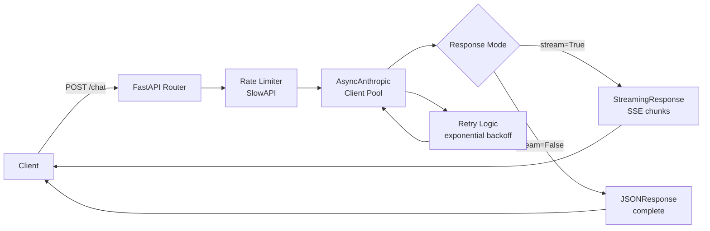

Building a FastAPI endpoint that calls an LLM seems straightforward until your application goes beyond a single user. Concurrency, streaming, latency, cost, and failure handling all need deliberate design choices. This post covers the patterns that hold up under real production load.

## The Baseline: A Naive LLM Endpoint

Here's what most tutorials show:

```python
from fastapi import FastAPI
from anthropic import Anthropic

app = FastAPI()
client = Anthropic()

@app.post("/chat")
def chat(message: str):
    response = client.messages.create(
        model="claude-sonnet-4-6",
        max_tokens=1024,
        messages=[{"role": "user", "content": message}]
    )
    return {"response": response.content[0].text}
```

This works for one user at a time. It breaks at scale because:
1. Synchronous — blocks a thread for the duration of the LLM call (2-30 seconds)
2. No streaming — user waits for the entire response before seeing anything
3. No error handling — any API failure returns a 500
4. New client per request — wastes connection setup time
5. No timeouts — a stuck LLM call blocks forever

## Pattern 1: Async + Streaming

The single most important change: make LLM calls async and stream responses to the client.

```python
from fastapi import FastAPI
from fastapi.responses import StreamingResponse
from anthropic import AsyncAnthropic
from pydantic import BaseModel
import asyncio

app = FastAPI()
# Singleton client — initialized once, reused across all requests
client = AsyncAnthropic()

class ChatRequest(BaseModel):
    message: str
    system: str = "You are a helpful assistant."
    max_tokens: int = 1024

@app.post("/chat/stream")
async def chat_stream(request: ChatRequest):
    async def generate():
        try:
            async with client.messages.stream(
                model="claude-sonnet-4-6",
                max_tokens=request.max_tokens,
                system=request.system,
                messages=[{"role": "user", "content": request.message}]
            ) as stream:
                async for text in stream.text_stream:
                    # SSE format: data: <content>\n\n
                    yield f"data: {text}\n\n"
            
            yield "data: [DONE]\n\n"
        
        except Exception as e:
            yield f"data: [ERROR] {str(e)}\n\n"
    
    return StreamingResponse(
        generate(),
        media_type="text/event-stream",
        headers={
            "Cache-Control": "no-cache",
            "Connection": "keep-alive",
            "X-Accel-Buffering": "no",  # Disable NGINX buffering
        }
    )

# Non-streaming endpoint for programmatic use
@app.post("/chat")
async def chat(request: ChatRequest) -> dict:
    response = await client.messages.create(
        model="claude-sonnet-4-6",
        max_tokens=request.max_tokens,
        system=request.system,
        messages=[{"role": "user", "content": request.message}]
    )
    return {
        "response": response.content[0].text,
        "input_tokens": response.usage.input_tokens,
        "output_tokens": response.usage.output_tokens,
    }
```

**Frontend consuming SSE:**
```javascript
const source = new EventSource('/chat/stream');
// Or with POST + fetch:
const response = await fetch('/chat/stream', {
    method: 'POST',
    headers: {'Content-Type': 'application/json'},
    body: JSON.stringify({message: userInput})
});

const reader = response.body.getReader();
const decoder = new TextDecoder();

while (true) {
    const {done, value} = await reader.read();
    if (done) break;
    const chunk = decoder.decode(value);
    const lines = chunk.split('\n').filter(l => l.startsWith('data: '));
    for (const line of lines) {
        const text = line.replace('data: ', '');
        if (text !== '[DONE]' && !text.startsWith('[ERROR]')) {
            outputElement.textContent += text;
        }
    }
}
```

## Pattern 2: Timeout and Retry with Exponential Backoff

LLM APIs are rate-limited and occasionally slow. Build retry logic into your endpoint:

```python
import asyncio
import time
from anthropic import AsyncAnthropic, RateLimitError, APIStatusError, APIConnectionError
from fastapi import HTTPException
import logging

logger = logging.getLogger(__name__)
client = AsyncAnthropic()

async def llm_call_with_retry(
    messages: list,
    model: str = "claude-sonnet-4-6",
    max_tokens: int = 1024,
    system: str = "",
    max_retries: int = 3,
    timeout: float = 60.0,
) -> str:
    """Call LLM with exponential backoff retry and timeout."""
    
    for attempt in range(max_retries):
        try:
            response = await asyncio.wait_for(
                client.messages.create(
                    model=model,
                    max_tokens=max_tokens,
                    system=system,
                    messages=messages,
                ),
                timeout=timeout
            )
            return response.content[0].text
        
        except asyncio.TimeoutError:
            logger.warning(f"LLM call timed out (attempt {attempt + 1}/{max_retries})")
            if attempt == max_retries - 1:
                raise HTTPException(status_code=504, detail="LLM response timeout")
        
        except RateLimitError as e:
            wait = 2 ** attempt  # 1s, 2s, 4s
            logger.warning(f"Rate limited. Waiting {wait}s before retry {attempt + 1}")
            await asyncio.sleep(wait)
            if attempt == max_retries - 1:
                raise HTTPException(status_code=429, detail="Rate limit exceeded after retries")
        
        except APIConnectionError:
            wait = 2 ** attempt
            logger.warning(f"Connection error. Retrying in {wait}s")
            await asyncio.sleep(wait)
            if attempt == max_retries - 1:
                raise HTTPException(status_code=503, detail="LLM service unavailable")
        
        except APIStatusError as e:
            if e.status_code >= 500:
                wait = 2 ** attempt
                await asyncio.sleep(wait)
            else:
                # 4xx errors are not retryable
                raise HTTPException(status_code=e.status_code, detail=str(e.message))
    
    raise HTTPException(status_code=500, detail="LLM call failed after all retries")
```

## Pattern 3: Background Tasks for Long-Running Jobs

For tasks that take > 30 seconds (document processing, batch analysis), don't keep the HTTP connection open. Use a job queue pattern:

```python
from fastapi import BackgroundTasks
from uuid import uuid4
import asyncio
from datetime import datetime

# In production, use Redis instead of in-memory dict
job_store: dict = {}

class JobStatus:
    PENDING = "pending"
    RUNNING = "running"
    COMPLETED = "completed"
    FAILED = "failed"

async def process_document_background(job_id: str, document: str, question: str):
    job_store[job_id]["status"] = JobStatus.RUNNING
    job_store[job_id]["started_at"] = datetime.utcnow().isoformat()
    
    try:
        # Potentially long-running: chunking, embedding, RAG, generation
        result = await run_rag_pipeline(document, question)
        
        job_store[job_id].update({
            "status": JobStatus.COMPLETED,
            "result": result,
            "completed_at": datetime.utcnow().isoformat()
        })
    except Exception as e:
        job_store[job_id].update({
            "status": JobStatus.FAILED,
            "error": str(e),
            "failed_at": datetime.utcnow().isoformat()
        })

@app.post("/analyze-document")
async def analyze_document(
    document: str,
    question: str,
    background_tasks: BackgroundTasks
) -> dict:
    job_id = str(uuid4())
    job_store[job_id] = {
        "status": JobStatus.PENDING,
        "created_at": datetime.utcnow().isoformat()
    }
    
    background_tasks.add_task(
        process_document_background, job_id, document, question
    )
    
    return {"job_id": job_id, "status_url": f"/jobs/{job_id}"}

@app.get("/jobs/{job_id}")
async def get_job_status(job_id: str) -> dict:
    if job_id not in job_store:
        raise HTTPException(status_code=404, detail="Job not found")
    return job_store[job_id]
```

## Pattern 4: Request Deduplication and Caching

Identical LLM requests should hit cache, not the API:

```python
import hashlib
import json
from functools import wraps
from typing import Optional
import redis.asyncio as redis

redis_client = redis.from_url("redis://localhost:6379")

def cache_key(model: str, messages: list, system: str) -> str:
    """Deterministic cache key from request parameters."""
    payload = json.dumps(
        {"model": model, "messages": messages, "system": system},
        sort_keys=True
    )
    return f"llm:cache:{hashlib.sha256(payload.encode()).hexdigest()}"

async def cached_llm_call(
    messages: list,
    model: str = "claude-sonnet-4-6",
    max_tokens: int = 1024,
    system: str = "",
    cache_ttl: int = 3600,  # 1 hour
    skip_cache: bool = False,
) -> dict:
    key = cache_key(model, messages, system)
    
    if not skip_cache:
        cached = await redis_client.get(key)
        if cached:
            return {**json.loads(cached), "cache_hit": True}
    
    response = await client.messages.create(
        model=model, max_tokens=max_tokens,
        system=system, messages=messages
    )
    
    result = {
        "text": response.content[0].text,
        "input_tokens": response.usage.input_tokens,
        "output_tokens": response.usage.output_tokens,
        "cache_hit": False,
    }
    
    await redis_client.setex(key, cache_ttl, json.dumps(
        {k: v for k, v in result.items() if k != "cache_hit"}
    ))
    
    return result
```

## Pattern 5: Model Router — Use Smaller Models Where You Can

Not every request needs the most capable model. Route based on complexity:

```python
from enum import Enum

class TaskComplexity(str, Enum):
    SIMPLE = "simple"       # Classification, yes/no, single fact
    MODERATE = "moderate"   # Summarization, extraction, short generation
    COMPLEX = "complex"     # Multi-step reasoning, long generation, code

MODEL_MAP = {
    TaskComplexity.SIMPLE: "claude-haiku-4-5-20251001",    # Fastest, cheapest
    TaskComplexity.MODERATE: "claude-sonnet-4-6",           # Balanced
    TaskComplexity.COMPLEX: "claude-opus-4-8",              # Most capable
}

async def classify_task_complexity(user_message: str) -> TaskComplexity:
    """Use a cheap model to classify task complexity."""
    response = await client.messages.create(
        model="claude-haiku-4-5-20251001",
        max_tokens=10,
        system="Classify the complexity of this task. Reply with exactly one word: simple, moderate, or complex.",
        messages=[{"role": "user", "content": user_message}]
    )
    
    label = response.content[0].text.strip().lower()
    return TaskComplexity(label) if label in TaskComplexity.__members__.values() else TaskComplexity.MODERATE

@app.post("/chat/smart")
async def smart_chat(request: ChatRequest) -> dict:
    complexity = await classify_task_complexity(request.message)
    model = MODEL_MAP[complexity]
    
    response = await client.messages.create(
        model=model,
        max_tokens=request.max_tokens,
        system=request.system,
        messages=[{"role": "user", "content": request.message}]
    )
    
    return {
        "response": response.content[0].text,
        "model_used": model,
        "complexity": complexity,
        "input_tokens": response.usage.input_tokens,
        "output_tokens": response.usage.output_tokens,
    }
```

## Pattern 6: Middleware for Observability

Add a middleware layer that logs every LLM request with timing and token usage:

```python
from fastapi import Request
from starlette.middleware.base import BaseHTTPMiddleware
import time
import structlog

log = structlog.get_logger()

class LLMObservabilityMiddleware(BaseHTTPMiddleware):
    async def dispatch(self, request: Request, call_next):
        start_time = time.time()
        
        response = await call_next(request)
        
        duration_ms = (time.time() - start_time) * 1000
        
        log.info(
            "api_request",
            path=request.url.path,
            method=request.method,
            status_code=response.status_code,
            duration_ms=round(duration_ms, 2),
        )
        
        response.headers["X-Response-Time"] = f"{duration_ms:.2f}ms"
        return response

app.add_middleware(LLMObservabilityMiddleware)
```

## Putting It Together: Production FastAPI LLM Service

```python
from contextlib import asynccontextmanager
from fastapi import FastAPI, Depends, HTTPException, BackgroundTasks
from anthropic import AsyncAnthropic
import structlog

log = structlog.get_logger()

@asynccontextmanager
async def lifespan(app: FastAPI):
    # Initialize resources on startup
    app.state.llm_client = AsyncAnthropic()
    app.state.redis = redis.from_url("redis://localhost:6379")
    log.info("Application started")
    yield
    # Cleanup on shutdown
    await app.state.redis.aclose()
    log.info("Application shutdown")

app = FastAPI(lifespan=lifespan)
app.add_middleware(LLMObservabilityMiddleware)

def get_llm_client(request: Request) -> AsyncAnthropic:
    return request.app.state.llm_client

@app.post("/chat")
async def chat(
    request: ChatRequest,
    client: AsyncAnthropic = Depends(get_llm_client)
) -> dict:
    return await llm_call_with_retry(
        messages=[{"role": "user", "content": request.message}],
        system=request.system,
        max_tokens=request.max_tokens,
    )
```

## Key Takeaways

1. **Always use async clients** — synchronous LLM calls block the event loop and destroy concurrency
2. **Stream to the client** — a streaming 8-second response feels better than a static 3-second one
3. **Initialize one client at startup** — reuse it across all requests via dependency injection
4. **Exponential backoff on rate limits** — with jitter for high-traffic scenarios
5. **Background tasks for jobs > 30 seconds** — return a job ID, let the client poll for results
6. **Route cheap tasks to cheaper models** — a classifier that uses Haiku to route to Opus pays for itself

---

*Part of the [LLM Engineering for Backend Developers series]({{ site.baseurl }}/tags/llm-engineering-series/) — production patterns for Python engineers building LLM-powered APIs.*


## ## FastAPI LLM Service Architecture


