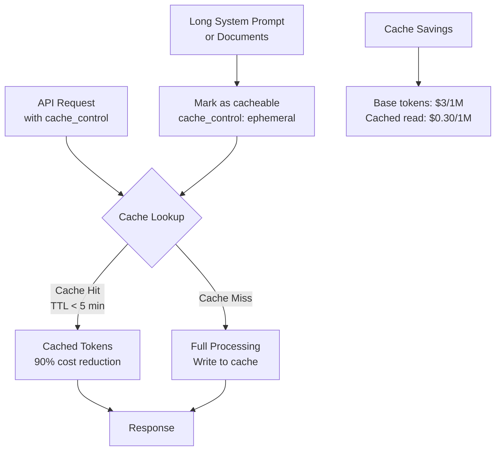

LLM API costs scale with usage in ways that aren't obvious at demo scale but become significant in production. At 10,000 requests per day with a 4,000-token system prompt, you're sending 40 million tokens of identical content to the API every day — and paying for every single one.

Prompt caching changes this equation dramatically. This post covers how caching works on both Anthropic and OpenAI, how to implement it correctly, and the other cost levers that matter in production.

## How Prompt Caching Works

LLMs process tokens sequentially. If you send the same large prefix (a long system prompt, a document, a set of examples) on every request, the model is doing redundant computation every time.

**Prompt caching** lets you pay to compute and cache a prefix once, then reuse it across many requests at a fraction of the cost.

```
Without caching:
Request 1: [4000 token system prompt] + [100 token user message] = 4100 tokens billed
Request 2: [4000 token system prompt] + [200 token user message] = 4200 tokens billed
...
1000 requests = 4,100,000 tokens billed

With caching (Anthropic):
Request 1: 4000 tokens to write cache + 100 token user message
Requests 2-1000: 100 (cache read, 90% cheaper) + user message tokens
1000 requests ≈ 500,000 equivalent tokens billed
```

## Anthropic Prompt Caching

Anthropic's caching is explicit — you mark exactly which parts of the prompt to cache using `cache_control`.

### Basic System Prompt Caching

```python
from anthropic import Anthropic

client = Anthropic()

# Large system prompt (this is what makes caching worthwhile)
SYSTEM_PROMPT = """You are a senior technical support engineer for a cloud storage product.

[Product Knowledge Base - 3000 tokens of documentation]
...
Authentication: Tokens expire after 3600 seconds by default. Configure via AUTH_TIMEOUT.
Rate Limits: Default 1000 req/min per API key. Configurable via /admin/settings.
Error Codes: 401 = invalid token, 403 = insufficient permissions, 429 = rate limited...
[... extensive product documentation ...]

Response Guidelines:
- Always cite the specific setting or configuration that addresses the issue
- If you cannot find the answer in the knowledge base, say so explicitly
- Provide the exact steps needed, not general advice
"""

def chat_with_cache(user_message: str, conversation_history: list = None) -> dict:
    messages = conversation_history or []
    messages.append({"role": "user", "content": user_message})
    
    response = client.messages.create(
        model="claude-sonnet-4-6",
        max_tokens=1024,
        # System prompt with cache_control — tells Anthropic to cache up to this point
        system=[
            {
                "type": "text",
                "text": SYSTEM_PROMPT,
                "cache_control": {"type": "ephemeral"}  # Cache for up to 5 minutes
            }
        ],
        messages=messages
    )
    
    # Inspect cache performance
    usage = response.usage
    cache_stats = {
        "cache_creation_tokens": usage.cache_creation_input_tokens,  # Paid at 1.25x on first call
        "cache_read_tokens": usage.cache_read_input_tokens,           # Paid at 0.1x on hits
        "uncached_tokens": usage.input_tokens,
        "output_tokens": usage.output_tokens,
    }
    
    return {
        "response": response.content[0].text,
        "cache_stats": cache_stats,
        "cache_hit": usage.cache_read_input_tokens > 0,
    }

# First call: writes cache
result = chat_with_cache("What is the default auth timeout?")
print(f"Cache hit: {result['cache_hit']}")  # False — first call writes
print(f"Cache creation tokens: {result['cache_stats']['cache_creation_tokens']}")  # ~3000

# Subsequent calls: reads from cache
result2 = chat_with_cache("How do I enable rate limiting?")
print(f"Cache hit: {result2['cache_hit']}")  # True
print(f"Cache read tokens: {result2['cache_stats']['cache_read_tokens']}")  # ~3000 at 0.1x cost
```

### Multi-Part Caching (Documents + System Prompt)

You can cache multiple sections independently, with up to 4 cache breakpoints per request:

```python
def rag_with_caching(user_question: str, document: str) -> str:
    """
    Cache the document alongside the system prompt.
    Useful when the same document is queried multiple times in a session.
    """
    response = client.messages.create(
        model="claude-sonnet-4-6",
        max_tokens=2048,
        system=[
            # Part 1: Static system instructions (cache these)
            {
                "type": "text",
                "text": "You are a document analysis assistant. Answer questions based only on the provided document.",
                "cache_control": {"type": "ephemeral"}
            },
            # Part 2: The document being analyzed (cache this too)
            {
                "type": "text",
                "text": f"Document:\n\n{document}",
                "cache_control": {"type": "ephemeral"}
            }
        ],
        messages=[
            {"role": "user", "content": user_question}
        ]
    )
    return response.content[0].text

# First question on a document: pays to write cache for both sections
answer1 = rag_with_caching("What is the main conclusion?", large_document)

# Second question on the same document: reads both sections from cache
answer2 = rag_with_caching("What evidence supports that conclusion?", large_document)
```

### Caching in Multi-Turn Conversations

Cache the growing conversation history to avoid re-processing previous turns:

```python
def multi_turn_with_cache(
    new_message: str,
    conversation_history: list,
    system_prompt: str,
) -> tuple[str, list]:
    """
    Cache the conversation history up to the last turn.
    Each new turn caches the previous history prefix.
    """
    # Build messages with cache control on the history
    messages = []
    
    if conversation_history:
        # Add all previous turns with cache control on the last assistant message
        for i, msg in enumerate(conversation_history):
            is_last = i == len(conversation_history) - 1
            
            if is_last and msg["role"] == "assistant":
                # Cache up to and including the last assistant response
                messages.append({
                    "role": msg["role"],
                    "content": [
                        {
                            "type": "text",
                            "text": msg["content"],
                            "cache_control": {"type": "ephemeral"}
                        }
                    ]
                })
            else:
                messages.append(msg)
    
    # Add the new user message
    messages.append({"role": "user", "content": new_message})
    
    response = client.messages.create(
        model="claude-sonnet-4-6",
        max_tokens=1024,
        system=[{"type": "text", "text": system_prompt, "cache_control": {"type": "ephemeral"}}],
        messages=messages
    )
    
    assistant_reply = response.content[0].text
    
    # Return updated history
    updated_history = conversation_history + [
        {"role": "user", "content": new_message},
        {"role": "assistant", "content": assistant_reply}
    ]
    
    return assistant_reply, updated_history
```

**Anthropic cache pricing:**
- Cache write: 1.25x normal input token price (paid once per TTL period)
- Cache read: 0.1x normal input token price
- Cache TTL: 5 minutes for ephemeral

Break-even: caching pays off after just 2 requests hitting the same cache entry.

---

## OpenAI Prompt Caching

OpenAI's caching is automatic — no code changes needed. If the first 1024+ tokens of your prompt match a previous request within the last few minutes, the cached portion is billed at 50% of the normal input rate.

```python
from openai import OpenAI

client = OpenAI()

# No special parameters needed — caching happens automatically
# if the prefix (system prompt + conversation history) matches

response = client.chat.completions.create(
    model="gpt-4o",
    messages=[
        {"role": "system", "content": long_system_prompt},  # Cached automatically if seen before
        {"role": "user", "content": user_message}
    ]
)

# Check if caching was used
usage = response.usage
if hasattr(usage, 'prompt_tokens_details'):
    cached_tokens = usage.prompt_tokens_details.cached_tokens
    print(f"Cached tokens: {cached_tokens} (50% discount)")
```

**Key difference from Anthropic:** OpenAI caches automatically but requires exact prefix match for 1024+ tokens. Anthropic requires explicit marking but is more flexible.

---

## Other Cost Levers

### 1. Token Counting Before Calling

Count tokens before sending a request to avoid surprises and enforce limits:

```python
def count_tokens_anthropic(messages: list, system: str = "") -> dict:
    """Count tokens without making a generation call."""
    response = client.messages.count_tokens(
        model="claude-sonnet-4-6",
        system=system,
        messages=messages
    )
    return {
        "input_tokens": response.input_tokens,
        "estimated_cost_usd": response.input_tokens * (3.0 / 1_000_000),  # Claude Sonnet rate
    }

def safe_chat(message: str, max_input_tokens: int = 4000) -> str:
    token_count = count_tokens_anthropic(
        messages=[{"role": "user", "content": message}],
        system=SYSTEM_PROMPT
    )
    
    if token_count["input_tokens"] > max_input_tokens:
        raise ValueError(
            f"Request too large: {token_count['input_tokens']} tokens "
            f"exceeds limit of {max_input_tokens}"
        )
    
    # Proceed with the call
    ...
```

### 2. Output Token Budgeting

Max tokens significantly affects cost for generation-heavy use cases:

```python
# Don't just set max_tokens=4096 everywhere
MAX_TOKENS_BY_TASK = {
    "classification": 10,        # Yes/No/Label — 10 tokens is enough
    "summarization": 300,        # Summary — 300 words max
    "extraction": 500,           # Structured extraction
    "explanation": 800,          # Explanation with examples
    "generation": 2048,          # Content generation
    "analysis": 4096,            # Deep analysis
}

def get_max_tokens(task_type: str) -> int:
    return MAX_TOKENS_BY_TASK.get(task_type, 1024)
```

### 3. Batch API for Async Workloads

For non-real-time processing (nightly jobs, document pipelines), use batch APIs at 50% discount:

```python
import anthropic
import json

client = anthropic.Anthropic()

# Create a batch of requests
requests = [
    {
        "custom_id": f"doc_{i}",
        "params": {
            "model": "claude-sonnet-4-6",
            "max_tokens": 500,
            "messages": [
                {"role": "user", "content": f"Summarize: {doc['content'][:2000]}"}
            ]
        }
    }
    for i, doc in enumerate(documents_to_process)
]

# Submit batch (async — returns immediately)
batch = client.messages.batches.create(requests=requests)
print(f"Batch ID: {batch.id}")
print(f"Status: {batch.processing_status}")  # "in_progress"

# Poll for completion (or use webhook)
import time

while True:
    batch_status = client.messages.batches.retrieve(batch.id)
    if batch_status.processing_status == "ended":
        break
    print(f"Processing... {batch_status.request_counts}")
    time.sleep(60)

# Retrieve results
for result in client.messages.batches.results(batch.id):
    if result.result.type == "succeeded":
        doc_id = result.custom_id
        text = result.result.message.content[0].text
        print(f"{doc_id}: {text[:100]}")
```

### 4. Cost Tracking Per Request

Know your actual costs in real time:

```python
# Anthropic pricing (as of early 2026 — always verify current pricing)
PRICING = {
    "claude-opus-4-8": {
        "input": 15.0 / 1_000_000,
        "output": 75.0 / 1_000_000,
        "cache_write": 18.75 / 1_000_000,
        "cache_read": 1.50 / 1_000_000,
    },
    "claude-sonnet-4-6": {
        "input": 3.0 / 1_000_000,
        "output": 15.0 / 1_000_000,
        "cache_write": 3.75 / 1_000_000,
        "cache_read": 0.30 / 1_000_000,
    },
    "claude-haiku-4-5-20251001": {
        "input": 0.80 / 1_000_000,
        "output": 4.0 / 1_000_000,
        "cache_write": 1.0 / 1_000_000,
        "cache_read": 0.08 / 1_000_000,
    },
}

def calculate_cost(model: str, usage) -> dict:
    pricing = PRICING.get(model, PRICING["claude-sonnet-4-6"])
    
    cost = (
        (getattr(usage, 'input_tokens', 0) * pricing["input"]) +
        (getattr(usage, 'output_tokens', 0) * pricing["output"]) +
        (getattr(usage, 'cache_creation_input_tokens', 0) * pricing["cache_write"]) +
        (getattr(usage, 'cache_read_input_tokens', 0) * pricing["cache_read"])
    )
    
    return {
        "cost_usd": round(cost, 6),
        "input_tokens": getattr(usage, 'input_tokens', 0),
        "output_tokens": getattr(usage, 'output_tokens', 0),
        "cache_write_tokens": getattr(usage, 'cache_creation_input_tokens', 0),
        "cache_read_tokens": getattr(usage, 'cache_read_input_tokens', 0),
    }
```

## Cost Optimization Priority

Apply these in order of impact:

```
1. Prompt caching          — 90% reduction on repeated prefixes
2. Right-size max_tokens   — match to actual task needs
3. Model routing           — Haiku for simple tasks, Sonnet for moderate, Opus for complex
4. Batch API               — 50% discount for async workloads
5. Response caching        — identical queries hit Redis, not the API
6. Shorter prompts         — every token counts; remove fluff from prompts
```

## Key Takeaways

1. **Prompt caching is the highest-impact optimization** — break-even at 2 requests with same prefix
2. **Anthropic caching is explicit and controllable** — mark cache breakpoints with `cache_control`
3. **OpenAI caching is automatic** — ensure your prefix is stable and > 1024 tokens
4. **Right-size max_tokens per task type** — don't use 4096 for classification tasks
5. **Use Batch API for offline processing** — 50% discount for non-real-time workloads
6. **Track cost per request** — you can't optimize what you don't measure

---

*Part of the [LLM Engineering for Backend Developers series]({{ site.baseurl }}/tags/llm-engineering-series/) — production patterns for Python engineers building LLM-powered APIs.*


## ## Prompt Cache Flow


