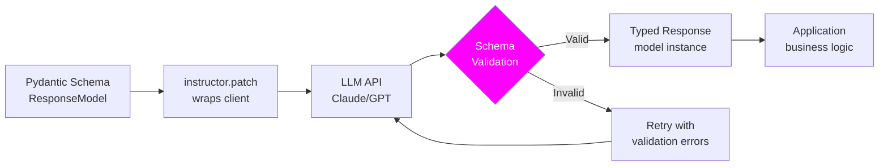

LLMs are good at generating text. They're unpredictable at generating valid JSON that conforms to a schema. Without guardrails, you'll see missing fields, wrong types, extra keys, invalid values, and markdown code fences wrapping the JSON you asked for.

Getting reliable structured output in production requires more than just saying "return JSON". This post covers the techniques — from basic JSON mode to Pydantic-validated responses with automatic retry — that make structured extraction dependable.

## Why Plain "Return JSON" Fails

```python
# This approach breaks in production
response = client.messages.create(
    model="claude-sonnet-4-6",
    max_tokens=500,
    messages=[{
        "role": "user",
        "content": "Extract the name, company, and email from: 'John Smith from Acme Corp, john@acme.com'. Return JSON."
    }]
)

# You might get any of these:
# {"name": "John Smith", "company": "Acme Corp", "email": "john@acme.com"}  ✓
# ```json\n{"name": "John Smith"...}\n```  ✗ (markdown fences)
# {"person_name": "John", "org": "Acme Corp"}  ✗ (wrong field names)
# {"name": "John Smith", "company": "Acme Corp"}  ✗ (missing email)
# Here is the extracted JSON:\n{"name": ...}  ✗ (preamble text)
```

Each of these requires different error handling and produces brittle downstream code.

## Level 1: Pydantic Models as the Schema Contract

Define your expected output as a Pydantic model. This gives you type safety, validation, and clear documentation of what you expect:

```python
from pydantic import BaseModel, EmailStr, Field, validator
from typing import Optional, Literal
from enum import Enum

class ContactInfo(BaseModel):
    name: str = Field(description="Full name of the person")
    company: Optional[str] = Field(None, description="Company or organization name")
    email: Optional[EmailStr] = Field(None, description="Email address")
    role: Optional[str] = Field(None, description="Job title or role")

class SentimentLabel(str, Enum):
    POSITIVE = "positive"
    NEGATIVE = "negative"
    NEUTRAL = "neutral"
    MIXED = "mixed"

class CustomerFeedbackAnalysis(BaseModel):
    sentiment: SentimentLabel
    confidence: float = Field(ge=0.0, le=1.0, description="Confidence score between 0 and 1")
    key_issues: list[str] = Field(default_factory=list, description="List of specific issues mentioned")
    requested_features: list[str] = Field(default_factory=list)
    requires_followup: bool
    priority: Literal["low", "medium", "high", "urgent"]
    summary: str = Field(max_length=200)
    
    @validator("key_issues", "requested_features", each_item=True)
    def items_not_empty(cls, v):
        if not v.strip():
            raise ValueError("Items cannot be empty strings")
        return v.strip()
```

## Level 2: OpenAI Structured Outputs

OpenAI's structured output mode guarantees the response matches your Pydantic schema — no JSON parsing errors:

```python
from openai import OpenAI
from pydantic import BaseModel

client = OpenAI()

class ExtractedContact(BaseModel):
    name: str
    company: str | None
    email: str | None
    phone: str | None

def extract_contact(text: str) -> ExtractedContact:
    response = client.beta.chat.completions.parse(
        model="gpt-4o",
        messages=[
            {
                "role": "system",
                "content": "Extract contact information from the provided text. If a field is not present, use null."
            },
            {"role": "user", "content": text}
        ],
        response_format=ExtractedContact  # Pydantic model as response format
    )
    
    # response.choices[0].message.parsed is already a validated ExtractedContact instance
    return response.choices[0].message.parsed

# Usage
contact = extract_contact("Reach out to Sarah Chen (sarah@techcorp.io) at TechCorp for the partnership discussion.")
print(contact.name)     # "Sarah Chen"
print(contact.email)    # "sarah@techcorp.io"
print(contact.company)  # "TechCorp"
print(contact.phone)    # None

# Type-safe — contact is a real ExtractedContact instance
assert isinstance(contact, ExtractedContact)
```

OpenAI's structured outputs use constrained decoding — the model is forced to produce tokens that match the schema, making parsing failures impossible. The tradeoff: the schema must be expressible as JSON Schema (no custom validators).

## Level 3: Anthropic Tool Use for Structured Extraction

Anthropic doesn't have a structured output mode like OpenAI, but tool use achieves the same result — the model is forced to call a tool with a specific schema:

```python
import anthropic
import json
from pydantic import BaseModel

client = anthropic.Anthropic()

def extract_with_tool_use(text: str, model_class: type[BaseModel]) -> BaseModel:
    """
    Force structured output via tool use.
    The model must call the 'extract' tool with the correct schema.
    """
    # Build JSON schema from Pydantic model
    schema = model_class.model_json_schema()
    
    response = client.messages.create(
        model="claude-sonnet-4-6",
        max_tokens=1024,
        tools=[
            {
                "name": "extract",
                "description": f"Extract structured information and return it as {model_class.__name__}",
                "input_schema": schema
            }
        ],
        tool_choice={"type": "tool", "name": "extract"},  # Force this specific tool
        messages=[
            {
                "role": "user",
                "content": f"Extract the required information from this text:\n\n{text}"
            }
        ]
    )
    
    # Find the tool use block
    for block in response.content:
        if block.type == "tool_use" and block.name == "extract":
            return model_class(**block.input)
    
    raise ValueError("Model did not return tool use response")

# Usage — same interface regardless of backend
class FeedbackAnalysis(BaseModel):
    sentiment: str
    key_issues: list[str]
    requires_followup: bool
    priority: str

feedback_text = "The API keeps returning 503 errors during peak hours. We've lost $50k in sales. This needs to be fixed immediately."
result = extract_with_tool_use(feedback_text, FeedbackAnalysis)

print(result.sentiment)         # "negative"
print(result.requires_followup) # True
print(result.priority)          # "urgent"
print(result.key_issues)        # ["API 503 errors during peak hours", "Revenue impact"]
```

## Level 4: Parse-and-Retry with Instructor

The `instructor` library wraps both OpenAI and Anthropic clients with automatic retry on parse failure:

```python
import instructor
from anthropic import Anthropic
from openai import OpenAI
from pydantic import BaseModel, ValidationError
from typing import Optional

# Anthropic with instructor
anthropic_client = instructor.from_anthropic(Anthropic())

# OpenAI with instructor
openai_client = instructor.from_openai(OpenAI())

class MeetingNotes(BaseModel):
    title: str
    date: str
    attendees: list[str]
    action_items: list[str]
    decisions: list[str]
    next_meeting: Optional[str] = None

def extract_meeting_notes(transcript: str) -> MeetingNotes:
    # instructor handles retry automatically if validation fails
    return anthropic_client.messages.create(
        model="claude-sonnet-4-6",
        max_tokens=1024,
        max_retries=3,  # Retry up to 3 times if Pydantic validation fails
        messages=[
            {
                "role": "user",
                "content": f"Extract meeting notes from this transcript:\n\n{transcript}"
            }
        ],
        response_model=MeetingNotes,
    )

# Same API for OpenAI
def extract_meeting_notes_openai(transcript: str) -> MeetingNotes:
    return openai_client.chat.completions.create(
        model="gpt-4o",
        max_retries=3,
        messages=[
            {"role": "user", "content": f"Extract meeting notes:\n\n{transcript}"}
        ],
        response_model=MeetingNotes,
    )
```

When validation fails, instructor feeds the error back to the model and asks it to fix its output — automatically, without you writing retry logic.

## Level 5: Manual Parse-and-Retry (No Third-Party Library)

If you'd rather not add instructor as a dependency, here's the retry pattern:

```python
import json
import re
from anthropic import Anthropic
from pydantic import BaseModel, ValidationError

client = Anthropic()

def extract_json_from_text(text: str) -> dict:
    """Extract JSON from LLM output, handling common formatting issues."""
    # Strip markdown code fences
    text = re.sub(r'```(?:json)?\s*', '', text)
    text = text.replace('```', '').strip()
    
    # Handle preamble text ("Here is the JSON: {...}")
    json_match = re.search(r'\{.*\}', text, re.DOTALL)
    if json_match:
        text = json_match.group()
    
    return json.loads(text)

def structured_extract(
    text: str,
    model_class: type[BaseModel],
    system_prompt: str,
    max_retries: int = 3,
) -> BaseModel:
    schema_str = json.dumps(model_class.model_json_schema(), indent=2)
    
    messages = [
        {
            "role": "user",
            "content": f"{system_prompt}\n\nReturn ONLY valid JSON matching this schema:\n{schema_str}\n\nText to analyze:\n{text}"
        }
    ]
    
    last_error = None
    for attempt in range(max_retries):
        response = client.messages.create(
            model="claude-sonnet-4-6",
            max_tokens=1024,
            messages=messages
        )
        
        raw = response.content[0].text
        
        try:
            parsed_json = extract_json_from_text(raw)
            return model_class(**parsed_json)
        
        except (json.JSONDecodeError, ValidationError, KeyError) as e:
            last_error = e
            if attempt < max_retries - 1:
                # Feed the error back to the model
                messages.extend([
                    {"role": "assistant", "content": raw},
                    {
                        "role": "user",
                        "content": (
                            f"Your response had an error: {str(e)}\n\n"
                            f"Please fix the JSON and return only valid JSON matching the schema. "
                            f"No markdown, no preamble, just the JSON object."
                        )
                    }
                ])
    
    raise ValueError(f"Failed to extract valid {model_class.__name__} after {max_retries} attempts: {last_error}")
```

## Prompt Engineering for Structured Output

The prompt matters even when using structured output modes:

```python
# Weak prompt
"Extract information from the text and return JSON."

# Strong prompt — reduces errors even with forced output
EXTRACTION_PROMPT = """Extract information from the provided text.

Rules:
- If a field is not mentioned in the text, use null (not "unknown" or "N/A")
- For lists, use an empty list [] if nothing is found (not null)
- sentiment must be exactly one of: positive, negative, neutral, mixed
- confidence must be a number between 0.0 and 1.0 (not a percentage)
- summary must be under 200 characters"""
```

Clear constraints on field values dramatically reduce validation failures.

## Handling Nested and Complex Schemas

```python
from pydantic import BaseModel
from typing import Optional
from datetime import date

class Address(BaseModel):
    street: Optional[str] = None
    city: str
    country: str
    postal_code: Optional[str] = None

class Person(BaseModel):
    name: str
    date_of_birth: Optional[str] = None  # Use str for dates — LLMs struggle with datetime objects
    address: Optional[Address] = None
    skills: list[str] = []

# For deeply nested schemas, provide an example in the prompt
EXAMPLE_OUTPUT = """
{
  "name": "Jane Doe",
  "date_of_birth": "1990-05-15",
  "address": {
    "city": "Pune",
    "country": "India",
    "street": "123 MG Road",
    "postal_code": "411001"
  },
  "skills": ["Python", "FastAPI", "Machine Learning"]
}
"""
```

## Key Takeaways

1. **Never rely on "return JSON" in the prompt alone** — it fails unpredictably in production
2. **Use OpenAI's `parse()` method** — constrained decoding guarantees schema compliance
3. **Use Anthropic's tool use with `tool_choice`** — forces the model to produce a specific schema
4. **`instructor` library handles retry transparently** — minimal code for maximum reliability
5. **Feed errors back to the model on retry** — let it see its mistake and correct it
6. **Pydantic validators are your safety net** — validate field values, not just types

---

*Part of the [LLM Engineering for Backend Developers series]({{ site.baseurl }}/tags/llm-engineering-series/) — production patterns for Python engineers building LLM-powered APIs.*


## ## Structured Output Validation Loop


