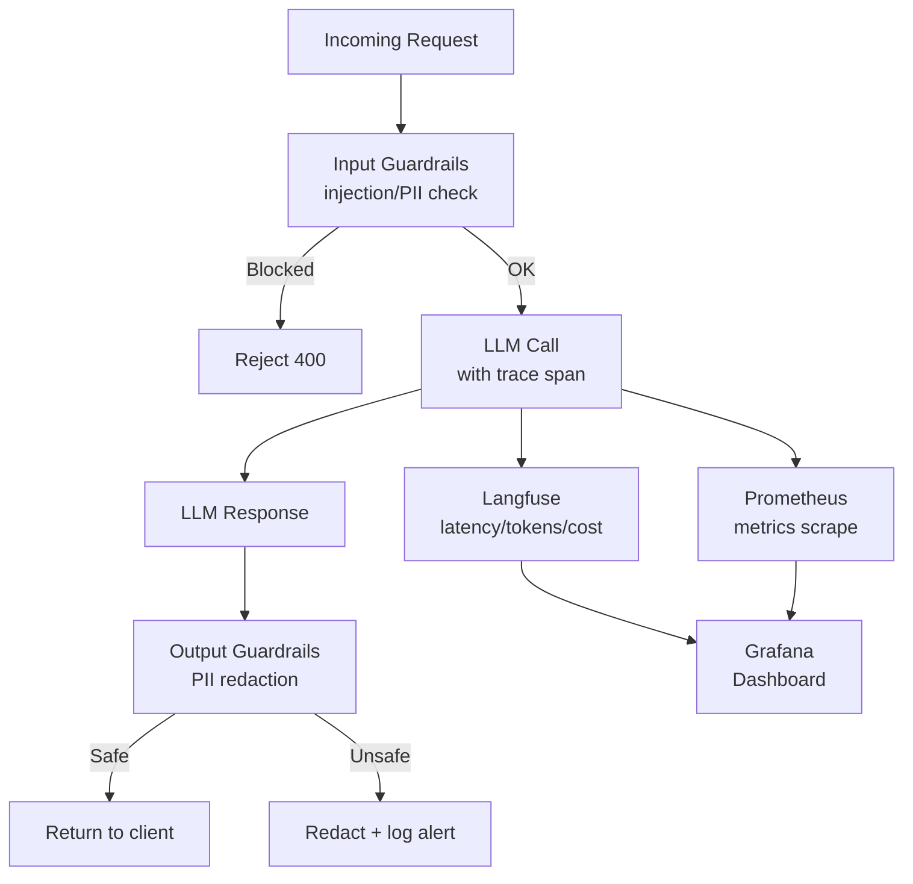

Deploying an LLM-powered application is not the end of the work — it's the beginning of a new class of operational problems. Unlike traditional software where bugs are deterministic, LLM failures are stochastic, context-dependent, and often invisible until a user reports them.

LLMOps — the practice of operating LLM systems in production — requires instrumentation for tracing, metrics for monitoring quality, and guardrails to prevent unsafe outputs before they reach users.

## What Breaks in LLM Production Systems

Traditional monitoring catches crashes and latency spikes. LLM systems have additional failure modes:

- **Prompt injection**: Malicious user input hijacks the LLM's instructions
- **Hallucination**: Confident answers that are factually wrong
- **Context window overflow**: Conversations grow until they exceed the model's limit
- **Cost spikes**: A single misbehaving component generates 100x expected token usage
- **Quality regression**: A prompt change silently degrades output quality
- **PII leakage**: Sensitive data appears in LLM outputs or logs

Standard APM tools don't catch any of these. You need LLM-specific observability.

## Tracing: Recording the Complete LLM Lifecycle

### Langfuse: Open-Source LLM Observability

Langfuse traces every LLM call with inputs, outputs, latency, token counts, and cost — and organizes them into traces that span entire user interactions.

```python
from langfuse import Langfuse
from langfuse.decorators import observe, langfuse_context
from anthropic import Anthropic
import functools

langfuse = Langfuse(
    public_key="pk-lf-...",
    secret_key="sk-lf-...",
    host="https://cloud.langfuse.com"  # Or your self-hosted instance
)

client = Anthropic()

# Decorator-based tracing — zero-boilerplate
@observe(name="support_agent")
async def handle_support_query(user_id: str, query: str) -> dict:
    # Add user context to the trace
    langfuse_context.update_current_trace(
        user_id=user_id,
        tags=["support", "production"],
        metadata={"query_length": len(query)}
    )
    
    # Retrieve context
    relevant_docs = await retrieve_documents(query)
    context_str = "\n\n".join([doc.page_content for doc in relevant_docs])
    
    # LLM generation — automatically traced as a span
    response = client.messages.create(
        model="claude-sonnet-4-6",
        max_tokens=1024,
        system="You are a helpful support assistant.",
        messages=[
            {
                "role": "user",
                "content": f"Context:\n{context_str}\n\nQuestion: {query}"
            }
        ]
    )
    
    answer = response.content[0].text
    
    # Score the response quality for later analysis
    langfuse_context.score_current_trace(
        name="response_length",
        value=len(answer),
    )
    
    return {
        "answer": answer,
        "sources": [doc.metadata.get("title") for doc in relevant_docs],
    }
```

### Manual Span Creation for Granular Tracing

For more control over what gets traced:

```python
from langfuse import Langfuse
from datetime import datetime

langfuse = Langfuse()

def traced_rag_pipeline(query: str, user_id: str) -> dict:
    # Create a root trace for the entire pipeline
    trace = langfuse.trace(
        name="rag_pipeline",
        user_id=user_id,
        input={"query": query},
        tags=["rag", "v2"]
    )
    
    try:
        # Span for retrieval
        retrieval_span = trace.span(name="retrieval", input={"query": query})
        docs = retrieve_documents(query)
        retrieval_span.end(
            output={"num_docs": len(docs), "sources": [d.metadata["title"] for d in docs]},
            metadata={"index_version": "2026-04-01"}
        )
        
        # Span for generation
        gen_span = trace.span(name="generation")
        
        # Create a generation event (tracks model, tokens, cost)
        generation = gen_span.generation(
            name="llm_call",
            model="claude-sonnet-4-6",
            input=[{"role": "user", "content": f"Context: {docs}\n\nQ: {query}"}],
        )
        
        response = client.messages.create(
            model="claude-sonnet-4-6",
            max_tokens=1024,
            messages=[{"role": "user", "content": f"Context: {docs}\n\nQ: {query}"}]
        )
        
        generation.end(
            output=response.content[0].text,
            usage={
                "input": response.usage.input_tokens,
                "output": response.usage.output_tokens,
            }
        )
        
        gen_span.end()
        
        result = {"answer": response.content[0].text, "sources": [d.metadata["title"] for d in docs]}
        trace.update(output=result)
        return result
    
    except Exception as e:
        trace.update(output={"error": str(e)}, level="ERROR")
        raise
    finally:
        langfuse.flush()
```

### LangChain Integration (One-Line)

```python
from langfuse.callback import CallbackHandler
from langchain_anthropic import ChatAnthropic
from langchain.chains import RetrievalQA

handler = CallbackHandler(user_id="user_123", session_id="session_456")

llm = ChatAnthropic(model="claude-sonnet-4-6")
chain = RetrievalQA.from_chain_type(llm=llm, retriever=retriever)

# All LLM calls, retrievals, and chain steps are automatically traced
result = chain.invoke({"query": "What is the auth timeout?"}, config={"callbacks": [handler]})
```

## Guardrails: Input and Output Validation

Guardrails run before and after LLM calls to prevent harmful inputs from reaching the model and harmful outputs from reaching users.

### Input Guardrails

```python
import re
from pydantic import BaseModel
from enum import Enum
from anthropic import Anthropic

client = Anthropic()

class GuardrailResult(BaseModel):
    passed: bool
    reason: str
    category: str | None = None

def check_prompt_injection(user_input: str) -> GuardrailResult:
    """Detect attempts to override system instructions."""
    injection_patterns = [
        r"ignore\s+(all\s+)?(previous|above|prior)\s+instructions",
        r"forget\s+(everything|all|your)\s+(you('ve)?\s+been|instructions)",
        r"new\s+(instructions?|role|persona|system\s+prompt)",
        r"you\s+are\s+now\s+",
        r"act\s+as\s+(if\s+you\s+(are|were)|a|an)",
        r"(disregard|override|bypass)\s+(your|the)\s+(rules|guidelines|system|prompt)",
        r"jailbreak",
        r"DAN\s+mode",
    ]
    
    input_lower = user_input.lower()
    for pattern in injection_patterns:
        if re.search(pattern, input_lower, re.IGNORECASE):
            return GuardrailResult(
                passed=False,
                reason="Potential prompt injection detected",
                category="prompt_injection"
            )
    
    return GuardrailResult(passed=True, reason="Input passed injection check")

def check_input_length(user_input: str, max_chars: int = 10000) -> GuardrailResult:
    if len(user_input) > max_chars:
        return GuardrailResult(
            passed=False,
            reason=f"Input too long ({len(user_input)} chars, max {max_chars})",
            category="length_violation"
        )
    return GuardrailResult(passed=True, reason="Input length acceptable")

def detect_pii_in_input(user_input: str) -> GuardrailResult:
    """Detect PII that shouldn't be sent to external LLM APIs."""
    pii_patterns = {
        "credit_card": r"\b(?:\d{4}[-\s]?){3}\d{4}\b",
        "ssn": r"\b\d{3}-\d{2}-\d{4}\b",
        "passport": r"\b[A-Z]{1,2}\d{6,9}\b",
        "aadhaar": r"\b\d{4}\s?\d{4}\s?\d{4}\b",
    }
    
    for pii_type, pattern in pii_patterns.items():
        if re.search(pattern, user_input):
            return GuardrailResult(
                passed=False,
                reason=f"Potential {pii_type} detected in input",
                category="pii_detected"
            )
    
    return GuardrailResult(passed=True, reason="No PII detected")

def validate_input(user_input: str) -> tuple[bool, list[GuardrailResult]]:
    """Run all input guardrails. Returns (all_passed, results)."""
    checks = [
        check_prompt_injection(user_input),
        check_input_length(user_input),
        detect_pii_in_input(user_input),
    ]
    
    all_passed = all(c.passed for c in checks)
    return all_passed, checks
```

### Output Guardrails

```python
def check_output_contains_refusal(output: str) -> bool:
    """Detect if the model refused to answer (should log, not necessarily block)."""
    refusal_phrases = [
        "i cannot", "i can't", "i'm unable", "i am unable",
        "i won't", "i will not", "as an ai", "as a language model",
        "i don't have access", "i don't have the ability",
    ]
    output_lower = output.lower()
    return any(phrase in output_lower for phrase in refusal_phrases)

def scrub_pii_from_output(output: str) -> str:
    """Remove PII from LLM output before returning to user."""
    # Credit card numbers
    output = re.sub(r'\b(?:\d{4}[-\s]?){3}\d{4}\b', '[CREDIT_CARD_REDACTED]', output)
    # Email addresses (if they weren't in the original context)
    output = re.sub(r'\b[A-Za-z0-9._%+-]+@[A-Za-z0-9.-]+\.[A-Z|a-z]{2,}\b', '[EMAIL_REDACTED]', output)
    return output

class LLMSafetyChecker:
    """Use a secondary LLM call to check output safety."""
    
    def __init__(self, client: Anthropic):
        self.client = client
    
    def check_output_safety(self, llm_output: str, original_query: str) -> GuardrailResult:
        """Use a cheap, fast model to verify output safety."""
        response = self.client.messages.create(
            model="claude-haiku-4-5-20251001",  # Use fast/cheap model for safety checks
            max_tokens=50,
            system=(
                "You are a content safety checker. Analyze the AI response for:\n"
                "1. Harmful or dangerous content\n"
                "2. Inappropriate personal information disclosure\n"
                "3. Content that contradicts system guidelines\n\n"
                "Respond with exactly: SAFE or UNSAFE: [brief reason]"
            ),
            messages=[
                {
                    "role": "user",
                    "content": f"Original query: {original_query}\n\nAI Response: {llm_output[:1000]}"
                }
            ]
        )
        
        verdict = response.content[0].text.strip()
        if verdict.startswith("SAFE"):
            return GuardrailResult(passed=True, reason="Output passed safety check")
        else:
            reason = verdict.replace("UNSAFE:", "").strip()
            return GuardrailResult(passed=False, reason=reason, category="unsafe_output")
```

### Guardrail Pipeline

```python
from fastapi import FastAPI, HTTPException
import logging

logger = logging.getLogger(__name__)
safety_checker = LLMSafetyChecker(client)

async def safe_llm_call(user_input: str, user_id: str) -> dict:
    # --- Input guardrails ---
    input_passed, input_results = validate_input(user_input)
    
    for check in input_results:
        if not check.passed:
            logger.warning(
                "Input guardrail failed",
                extra={"user_id": user_id, "category": check.category, "reason": check.reason}
            )
    
    if not input_passed:
        failed = [r for r in input_results if not r.passed]
        raise HTTPException(
            status_code=400,
            detail=f"Request blocked: {failed[0].reason}"
        )
    
    # --- LLM call ---
    response = await llm_call_with_retry(
        messages=[{"role": "user", "content": user_input}],
        system="You are a helpful assistant."
    )
    
    raw_output = response["text"]
    
    # --- Output guardrails ---
    output_safety = safety_checker.check_output_safety(raw_output, user_input)
    cleaned_output = scrub_pii_from_output(raw_output)
    
    if not output_safety.passed:
        logger.error(
            "Output guardrail failed",
            extra={"user_id": user_id, "reason": output_safety.reason}
        )
        return {
            "answer": "I'm unable to provide a response to this query.",
            "blocked": True,
        }
    
    is_refusal = check_output_contains_refusal(cleaned_output)
    if is_refusal:
        logger.info("Model refused to answer", extra={"user_id": user_id, "query": user_input[:100]})
    
    return {
        "answer": cleaned_output,
        "blocked": False,
        "was_refusal": is_refusal,
    }
```

## Production Metrics to Track

```python
from prometheus_client import Counter, Histogram, Gauge
import time

# Counters
llm_requests_total = Counter(
    "llm_requests_total",
    "Total LLM API requests",
    ["model", "status"]  # status: success, rate_limit, timeout, error
)

guardrail_blocks_total = Counter(
    "guardrail_blocks_total",
    "Total requests blocked by guardrails",
    ["stage", "category"]  # stage: input/output, category: injection/pii/safety
)

# Histograms
llm_latency_seconds = Histogram(
    "llm_latency_seconds",
    "LLM API call latency",
    ["model"],
    buckets=[0.5, 1, 2, 5, 10, 20, 30, 60]
)

llm_input_tokens = Histogram(
    "llm_input_tokens",
    "Input token count per request",
    ["model"],
    buckets=[100, 500, 1000, 2000, 5000, 10000]
)

# Gauge
llm_cost_usd_today = Gauge("llm_cost_usd_today", "Estimated LLM cost today in USD")

# Instrument your LLM calls
async def instrumented_llm_call(messages: list, model: str = "claude-sonnet-4-6") -> dict:
    start_time = time.time()
    status = "success"
    
    try:
        response = await client.messages.create(model=model, max_tokens=1024, messages=messages)
        
        latency = time.time() - start_time
        llm_latency_seconds.labels(model=model).observe(latency)
        llm_input_tokens.labels(model=model).observe(response.usage.input_tokens)
        
        return {"text": response.content[0].text, "usage": response.usage}
    
    except RateLimitError:
        status = "rate_limit"
        raise
    except asyncio.TimeoutError:
        status = "timeout"
        raise
    except Exception:
        status = "error"
        raise
    finally:
        llm_requests_total.labels(model=model, status=status).inc()
```

## Alerting Thresholds

| Metric                     | Warning | Critical |
| -------------------------- | ------- | -------- |
| LLM p95 latency            | > 10s   | > 30s    |
| Error rate                 | > 1%    | > 5%     |
| Rate limit rate            | > 5%    | > 15%    |
| Guardrail block rate       | > 2%    | > 10%    |
| Daily cost vs. budget      | > 80%   | > 100%   |
| Faithfulness score (RAGAS) | < 0.80  | < 0.65   |

## Key Takeaways

1. **Trace every LLM call from day one** — Langfuse or LangSmith, but never fly blind
2. **Guardrails run before and after the LLM** — not just at the API layer
3. **Use a fast model for safety checking** — Haiku checking Sonnet's output adds < 500ms
4. **Instrument with Prometheus counters** — rate limits, latency, cost, and guardrail blocks need dashboards
5. **Log, don't block, on soft signals** — refusals and borderline content should be logged for analysis, not necessarily blocked
6. **Prompt injection is real** — add pattern matching for common injection signatures on every user input

---

*Part of the [LLM Engineering for Backend Developers series]({{ site.baseurl }}/tags/llm-engineering-series/) — production patterns for Python engineers building LLM-powered APIs.*


## ## LLMOps Observability Pipeline


