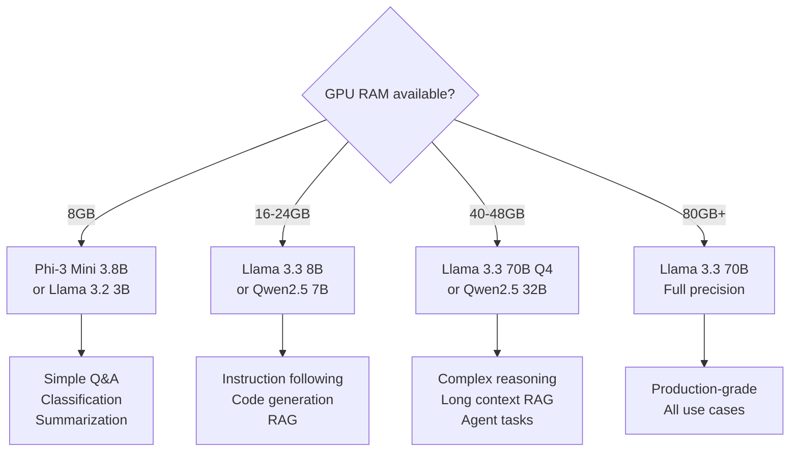

Not every workload belongs in a public LLM API. Regulatory requirements, data sovereignty, cost at scale, and latency constraints all push certain use cases toward self-hosted models. Running an on-premise LLM is no longer the research-only territory it was two years ago — modern inference servers make it production-grade with minimal operational overhead.

This post covers the full stack: model selection, inference server setup, Docker deployment, and Kubernetes scaling — with a focus on what actually works in production.

## When to Self-Host

| Driver               | Cloud API                    | Self-Hosted                        |
| -------------------- | ---------------------------- | ---------------------------------- |
| **Data sensitivity** | Sensitive data goes off-prem | All data stays on your infra       |
| **Regulatory**       | Standard compliance          | HIPAA, GDPR, DPDP Act, FedRAMP     |
| **Cost at scale**    | Linear with tokens           | Fixed infra + marginal electricity |
| **Latency**          | 200-2000ms typical           | < 100ms p99 possible               |
| **Customization**    | Fine-tuning via API          | Full control over training, LoRA   |
| **Availability**     | Dependent on provider SLA    | Controlled by your infra team      |

Self-hosting makes sense when: data cannot leave your VPC, you need < 100ms latency, or you're doing > 1M requests/day (cost crossover point varies by model and provider).

## Model Selection: Which Llama to Use



**Practical guidance:**
- **Llama 3.3 70B** is the best open-source general-purpose model as of early 2026 — comparable to GPT-4o on most tasks
- **Qwen2.5 Coder 7B/32B** outperforms Llama on code generation tasks despite smaller size
- **Phi-3 Mini** is remarkable for its size — deployable on CPU for low-throughput workloads
- **Quantized models (Q4/Q8)** trade ~5% quality for 50-75% memory reduction — appropriate for production

---

## Inference Server Options

### Option 1: Ollama (Easiest Setup)

Best for development, single-user, or low-throughput production:

```bash
# Install
curl -fsSL https://ollama.ai/install.sh | sh

# Pull and run a model
ollama pull llama3.3:70b-instruct-q4_K_M
ollama serve  # Starts on localhost:11434

# Test
curl http://localhost:11434/api/generate -d '{
  "model": "llama3.3:70b-instruct-q4_K_M",
  "prompt": "What is the capital of France?",
  "stream": false
}'
```

**OpenAI-compatible API** (works with any OpenAI SDK):
```python
from openai import OpenAI

client = OpenAI(
    base_url="http://localhost:11434/v1",
    api_key="ollama"  # Any string works
)

response = client.chat.completions.create(
    model="llama3.3:70b-instruct-q4_K_M",
    messages=[{"role": "user", "content": "Explain RAG in 3 sentences."}]
)
print(response.choices[0].message.content)
```

**Ollama limitations**: Single request at a time (no true concurrency), no batching, not designed for horizontal scaling.

---

### Option 2: vLLM (Production-Grade)

vLLM is the industry standard for high-throughput LLM serving. It implements PagedAttention for efficient GPU memory utilization and supports continuous batching for high concurrency.

```bash
pip install vllm

# Start the server (requires GPU)
python -m vllm.entrypoints.openai.api_server \
  --model meta-llama/Llama-3.3-70B-Instruct \
  --quantization awq \                    # Use AWQ quantization for memory efficiency
  --dtype auto \
  --max-model-len 8192 \                  # Maximum context length
  --max-num-seqs 256 \                    # Max concurrent sequences
  --gpu-memory-utilization 0.90 \         # Use 90% of GPU memory
  --host 0.0.0.0 \
  --port 8000 \
  --api-key "your-api-key"                # Optional: add basic auth
```

**vLLM serves an OpenAI-compatible API:**
```python
from openai import AsyncOpenAI
import asyncio

client = AsyncOpenAI(
    base_url="http://your-vllm-server:8000/v1",
    api_key="your-api-key"
)

async def generate(prompt: str) -> str:
    response = await client.chat.completions.create(
        model="meta-llama/Llama-3.3-70B-Instruct",
        messages=[{"role": "user", "content": prompt}],
        max_tokens=512,
        temperature=0.1,
    )
    return response.choices[0].message.content

# Test concurrent requests — vLLM handles these efficiently
async def benchmark_concurrency(num_requests: int = 50):
    prompts = [f"Explain concept {i} in AI" for i in range(num_requests)]
    tasks = [generate(p) for p in prompts]
    
    import time
    start = time.time()
    results = await asyncio.gather(*tasks)
    elapsed = time.time() - start
    
    print(f"{num_requests} requests in {elapsed:.2f}s ({num_requests/elapsed:.1f} req/s)")
    return results

asyncio.run(benchmark_concurrency(50))
```

**Multi-GPU setup (tensor parallelism):**
```bash
# Split a 70B model across 2 GPUs
python -m vllm.entrypoints.openai.api_server \
  --model meta-llama/Llama-3.3-70B-Instruct \
  --tensor-parallel-size 2 \   # Split across 2 GPUs
  --dtype bfloat16 \
  --max-model-len 16384
```

---

## Docker Deployment

```dockerfile
# Dockerfile
FROM vllm/vllm-openai:latest

# Pre-download model during build (optional — reduces startup time)
ARG MODEL_NAME=meta-llama/Llama-3.3-70B-Instruct
ENV MODEL_NAME=${MODEL_NAME}

# Copy startup script
COPY start_server.sh /start_server.sh
RUN chmod +x /start_server.sh

EXPOSE 8000
ENTRYPOINT ["/start_server.sh"]
```

```bash
#!/bin/bash
# start_server.sh
python -m vllm.entrypoints.openai.api_server \
  --model ${MODEL_NAME} \
  --quantization ${QUANTIZATION:-awq} \
  --max-model-len ${MAX_MODEL_LEN:-8192} \
  --gpu-memory-utilization ${GPU_UTIL:-0.90} \
  --host 0.0.0.0 \
  --port 8000
```

```yaml
# docker-compose.yml
version: '3.8'

services:
  vllm:
    build: .
    ports:
      - "8000:8000"
    environment:
      - MODEL_NAME=meta-llama/Llama-3.3-70B-Instruct
      - QUANTIZATION=awq
      - MAX_MODEL_LEN=8192
      - HF_TOKEN=${HF_TOKEN}  # For gated models
    volumes:
      - huggingface_cache:/root/.cache/huggingface  # Cache downloaded models
    deploy:
      resources:
        reservations:
          devices:
            - driver: nvidia
              count: 1
              capabilities: [gpu]
    healthcheck:
      test: ["CMD", "curl", "-f", "http://localhost:8000/health"]
      interval: 30s
      timeout: 10s
      retries: 3

volumes:
  huggingface_cache:
```

```bash
# Run
HF_TOKEN=hf_your_token docker-compose up -d

# Check health
curl http://localhost:8000/health
curl http://localhost:8000/v1/models  # List available models
```

---

## Kubernetes Deployment with Auto-Scaling

```yaml
# k8s/vllm-deployment.yaml
apiVersion: apps/v1
kind: Deployment
metadata:
  name: vllm-inference
  namespace: llm-serving
spec:
  replicas: 1
  selector:
    matchLabels:
      app: vllm-inference
  template:
    metadata:
      labels:
        app: vllm-inference
    spec:
      containers:
        - name: vllm
          image: vllm/vllm-openai:latest
          command:
            - python
            - -m
            - vllm.entrypoints.openai.api_server
          args:
            - --model
            - meta-llama/Llama-3.3-70B-Instruct
            - --quantization
            - awq
            - --max-model-len
            - "8192"
            - --gpu-memory-utilization
            - "0.90"
            - --host
            - "0.0.0.0"
            - --port
            - "8000"
          ports:
            - containerPort: 8000
          env:
            - name: HF_TOKEN
              valueFrom:
                secretKeyRef:
                  name: huggingface-token
                  key: token
          resources:
            limits:
              nvidia.com/gpu: "1"
              memory: "80Gi"
            requests:
              nvidia.com/gpu: "1"
              memory: "60Gi"
          volumeMounts:
            - name: model-cache
              mountPath: /root/.cache/huggingface
          readinessProbe:
            httpGet:
              path: /health
              port: 8000
            initialDelaySeconds: 120  # Models take time to load
            periodSeconds: 10
          livenessProbe:
            httpGet:
              path: /health
              port: 8000
            initialDelaySeconds: 180
            periodSeconds: 30
      volumes:
        - name: model-cache
          persistentVolumeClaim:
            claimName: model-cache-pvc
      nodeSelector:
        cloud.google.com/gke-accelerator: nvidia-l4  # Or your GPU node type

---
apiVersion: v1
kind: Service
metadata:
  name: vllm-service
  namespace: llm-serving
spec:
  selector:
    app: vllm-inference
  ports:
    - port: 80
      targetPort: 8000
  type: ClusterIP  # Use LoadBalancer for external access

---
# Horizontal Pod Autoscaler based on GPU utilization
apiVersion: autoscaling/v2
kind: HorizontalPodAutoscaler
metadata:
  name: vllm-hpa
  namespace: llm-serving
spec:
  scaleTargetRef:
    apiVersion: apps/v1
    kind: Deployment
    name: vllm-inference
  minReplicas: 1
  maxReplicas: 4
  metrics:
    - type: Resource
      resource:
        name: cpu
        target:
          type: Utilization
          averageUtilization: 70
```

---

## NGINX as Reverse Proxy with Rate Limiting

```nginx
# nginx.conf
upstream vllm_backends {
    least_conn;
    server vllm-service:80;
    # Add more backends as you scale
    # server vllm-service-2:80;
}

limit_req_zone $binary_remote_addr zone=llm_limit:10m rate=10r/m;

server {
    listen 443 ssl;
    server_name llm.yourdomain.com;

    ssl_certificate /etc/ssl/certs/cert.pem;
    ssl_certificate_key /etc/ssl/private/key.pem;

    location /v1/ {
        # Rate limiting: 10 requests per minute per IP
        limit_req zone=llm_limit burst=5 nodelay;
        limit_req_status 429;

        # Auth header validation
        auth_request /auth;

        proxy_pass http://vllm_backends;
        proxy_http_version 1.1;
        proxy_set_header Connection "";  # Keep-alive for streaming
        
        # Critical for streaming responses
        proxy_buffering off;
        proxy_cache off;
        
        # Generous timeouts for long LLM responses
        proxy_read_timeout 300s;
        proxy_connect_timeout 10s;
    }
}
```

## Using Your Self-Hosted LLM in Python

Since vLLM serves an OpenAI-compatible API, swap the base URL and you're done:

```python
from openai import AsyncOpenAI
from langchain_openai import ChatOpenAI
from anthropic import Anthropic

# Drop-in replacement for OpenAI SDK
vllm_client = AsyncOpenAI(
    base_url="https://llm.yourdomain.com/v1",
    api_key="your-internal-api-key"
)

# Or with LangChain
llm = ChatOpenAI(
    model="meta-llama/Llama-3.3-70B-Instruct",
    base_url="https://llm.yourdomain.com/v1",
    api_key="your-internal-api-key",
    streaming=True,
)

# Use exactly like you'd use any LangChain LLM
response = llm.invoke("Explain vector databases in 3 sentences.")
```

## Performance Benchmarking

Before deploying to production, benchmark your setup:

```python
import asyncio
import time
from openai import AsyncOpenAI
from dataclasses import dataclass

@dataclass
class BenchmarkResult:
    total_requests: int
    total_time_s: float
    requests_per_second: float
    avg_latency_ms: float
    p95_latency_ms: float
    p99_latency_ms: float
    tokens_per_second: float

async def run_benchmark(
    base_url: str,
    model: str,
    num_requests: int = 100,
    concurrency: int = 10,
    prompt: str = "Explain machine learning in 100 words."
) -> BenchmarkResult:
    client = AsyncOpenAI(base_url=base_url, api_key="test")
    latencies = []
    total_tokens = 0
    
    semaphore = asyncio.Semaphore(concurrency)
    
    async def single_request():
        async with semaphore:
            start = time.time()
            response = await client.chat.completions.create(
                model=model,
                messages=[{"role": "user", "content": prompt}],
                max_tokens=150,
            )
            latency_ms = (time.time() - start) * 1000
            latencies.append(latency_ms)
            return response.usage.completion_tokens
    
    start_total = time.time()
    results = await asyncio.gather(*[single_request() for _ in range(num_requests)])
    total_time = time.time() - start_total
    total_tokens = sum(results)
    
    latencies.sort()
    
    return BenchmarkResult(
        total_requests=num_requests,
        total_time_s=total_time,
        requests_per_second=num_requests / total_time,
        avg_latency_ms=sum(latencies) / len(latencies),
        p95_latency_ms=latencies[int(0.95 * len(latencies))],
        p99_latency_ms=latencies[int(0.99 * len(latencies))],
        tokens_per_second=total_tokens / total_time,
    )

result = asyncio.run(run_benchmark(
    base_url="http://localhost:8000/v1",
    model="meta-llama/Llama-3.3-70B-Instruct",
    num_requests=100,
    concurrency=20,
))

print(f"Throughput: {result.requests_per_second:.1f} req/s")
print(f"Avg latency: {result.avg_latency_ms:.0f}ms")
print(f"P99 latency: {result.p99_latency_ms:.0f}ms")
print(f"Tokens/sec: {result.tokens_per_second:.0f}")
```

## Key Takeaways

1. **vLLM is the production standard** — PagedAttention and continuous batching are not optional at scale
2. **Start with quantized models** — AWQ Q4 gives 75% memory reduction with < 5% quality loss
3. **OpenAI-compatible API means zero code changes** — swap `base_url` and keep everything else
4. **Model loading takes 2-5 minutes** — configure generous readiness probe delays in Kubernetes
5. **NGINX rate limiting is essential** — a single runaway client can saturate your GPU
6. **Benchmark before shipping** — target > 10 req/s at p99 < 5s for interactive workloads

---

*Part of the [LLM Engineering for Backend Developers series](({{ site.baseurl }}/tags/llm-engineering-series/) — production patterns for Python engineers building LLM-powered APIs.*
