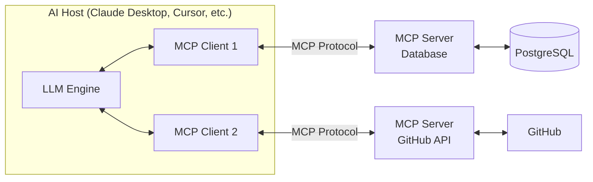

Every AI assistant and agent framework has traditionally required its own custom integrations. Want Claude to query your database? Write a tool. Want Cursor to access your internal docs? Write a plugin. Want your LangChain agent to call your internal APIs? Write a wrapper. Each integration is one-off, non-portable, and has to be rebuilt for every new AI host.

Model Context Protocol (MCP) solves this. It's an open standard for connecting AI systems to external tools and data sources — write the integration once, use it with any MCP-compatible AI host.

## The N×M Integration Problem

Before MCP, every AI host (Claude, GPT, Gemini, Cursor, Windsurf) needed custom integrations for every data source (databases, APIs, filesystems, SaaS tools):

```
Claude Desktop  ──────── Database
Claude Desktop  ──────── GitHub API
Claude Desktop  ──────── Internal Docs
Cursor          ──────── Database
Cursor          ──────── GitHub API
Cursor          ──────── Internal Docs
LangChain Agent ──────── Database
...

Result: N hosts × M tools = N×M custom integrations
```

With MCP:

```
Claude Desktop ─┐
Cursor         ─┤── MCP Client ──── MCP Server: Database
LangChain Agent─┤── MCP Client ──── MCP Server: GitHub
Any MCP Host   ─┘── MCP Client ──── MCP Server: Internal Docs

Result: N hosts × 1 protocol = M servers used by all hosts
```

Build an MCP server once, and every MCP-compatible AI host can use it.

## The Architecture: Hosts, Clients, and Servers

MCP has three roles:



**Host**: The AI application — Claude Desktop, Cursor, Windsurf, or your custom agent. The host manages one or more MCP clients.

**Client**: A connection to a single MCP server. The client handles the protocol — authentication, message framing, capability negotiation.

**Server**: An external process that exposes tools, resources, or prompts over the MCP protocol. This is what you build when you want to give AI access to your systems.

## What MCP Servers Can Expose

MCP defines three primitives:

### 1. Tools

Functions the LLM can call — analogous to LangChain tools or OpenAI function calls, but portable across hosts:

```json
{
  "name": "query_database",
  "description": "Execute a read-only SQL query against the analytics database",
  "inputSchema": {
    "type": "object",
    "properties": {
      "query": {
        "type": "string",
        "description": "SQL SELECT query to execute"
      },
      "limit": {
        "type": "integer",
        "description": "Maximum rows to return (default 100, max 1000)",
        "default": 100
      }
    },
    "required": ["query"]
  }
}
```

### 2. Resources

Static or dynamic data that the LLM can read — like files, database records, or API responses. Resources are identified by URIs:

```
database://analytics/users          → Read user table schema
file:///docs/api-reference.md       → Read API documentation
github://org/repo/issues/active     → Read open GitHub issues
```

Resources flow into the LLM's context as content — they're not called like functions, they're read like documents.

### 3. Prompts

Pre-defined prompt templates that the host can surface to users:

```json
{
  "name": "analyze_query_performance",
  "description": "Analyze a slow SQL query and suggest optimizations",
  "arguments": [
    {
      "name": "query",
      "description": "The SQL query to analyze",
      "required": true
    }
  ]
}
```

Users invoke prompts explicitly ("use the analyze_query_performance prompt with this query"), whereas tools are invoked by the LLM automatically.

## How the Protocol Works

MCP uses JSON-RPC 2.0 over different transport layers:

```
Transport Options:
┌─────────────────────────────────────────────┐
│ stdio (default for local servers)           │
│ Server reads from stdin, writes to stdout   │
│ Host spawns server as a subprocess          │
└─────────────────────────────────────────────┘

┌─────────────────────────────────────────────┐
│ HTTP + SSE (for remote/network servers)     │
│ Client sends HTTP POST, server pushes SSE   │
│ Enables remote MCP servers                  │
└─────────────────────────────────────────────┘
```

A typical interaction sequence:

```
1. Client → Server: initialize (negotiate capabilities and protocol version)
2. Server → Client: initialized (confirm capabilities: tools, resources, prompts)
3. Client → Server: tools/list (discover available tools)
4. Server → Client: list of tools with schemas
5. LLM decides to call a tool
6. Client → Server: tools/call {name: "query_database", arguments: {...}}
7. Server → Client: result {content: [{type: "text", text: "..."}]}
8. Client → LLM: tool result for context
```

## The Ecosystem: Who Supports MCP

MCP was introduced by Anthropic in late 2024 and has grown rapidly:

**AI Hosts with MCP support:**
- Claude Desktop (Anthropic)
- Claude Code CLI (Anthropic)
- Cursor
- Windsurf
- Continue.dev
- Zed Editor
- Any LangChain/LangGraph agent using the MCP adapter

**Official MCP Servers (from Anthropic and community):**
- File system access
- GitHub (repos, issues, PRs)
- PostgreSQL / SQLite
- Slack
- Google Drive
- Web search (Brave, Exa)
- Browser automation (Playwright)
- Memory / knowledge graphs

**Why this matters**: The ecosystem means you can give your Claude Code session access to GitHub issues, your internal database, and your Confluence docs — all with a few lines of configuration and no custom code.

## MCP vs. Traditional Tool Calling

| Dimension      | Traditional Tool Calling   | MCP                                      |
| -------------- | -------------------------- | ---------------------------------------- |
| **Scope**      | One LLM framework          | Any MCP-compatible host                  |
| **Protocol**   | Framework-specific         | Standardized JSON-RPC                    |
| **Discovery**  | Hardcoded at agent init    | Dynamic — server advertises capabilities |
| **Transport**  | In-process function call   | stdio or HTTP (separate process)         |
| **Reuse**      | Must rewrite per framework | Write once, use everywhere               |
| **Security**   | Embedded in agent code     | Isolated process, explicit permissions   |
| **Versioning** | Agent restart required     | Server can update independently          |

## A Simple Mental Model

Think of MCP like a USB standard for AI.

Before USB, every peripheral needed a custom port — serial, parallel, PS/2, proprietary. USB created one standard connector: you build to the USB spec and it works with any computer.

MCP is USB for AI tools. Build your integration to the MCP spec, and it works with any MCP-compatible AI host — today and as new hosts emerge.

## What This Means for You as an AI Engineer

If you're building tools for LLM agents:
- **Build MCP servers, not framework-specific tools** — your investment is reusable
- **Your internal tools can be AI-native** — expose your database, monitoring, ticketing system as MCP servers and every AI tool in your stack can use them
- **Agent orchestration becomes composable** — swap models and frameworks without rewriting tool integrations

If you're building agents:
- **Use existing MCP servers before writing custom tools** — the community has already built integrations for most common services
- **MCP gives you capability without complexity** — a 20-line config file can give your agent filesystem access, GitHub access, and database access

## Key Takeaways

1. **MCP solves the N×M integration problem** — build once, use with any AI host
2. **Three primitives: tools (actions), resources (data), prompts (templates)**
3. **JSON-RPC over stdio or HTTP** — the server is a separate process with explicit permissions
4. **The ecosystem is growing fast** — check the MCP server registry before building custom integrations
5. **Think of it as USB for AI** — one standard connector for all your tools

---

*Part of the [MCP Deep Dive series]({{ site.baseurl }}/tags/mcp-series/) — building production-grade integrations with Model Context Protocol.*
