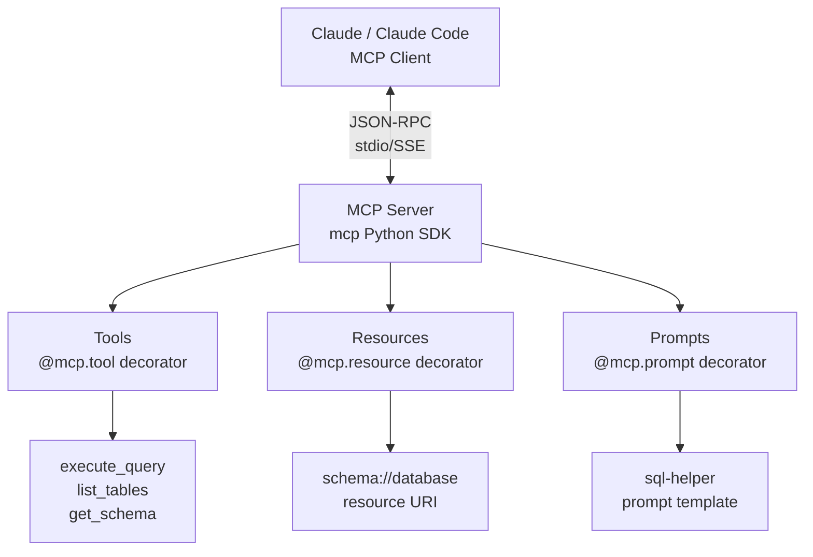

The best way to understand MCP is to build a server. In this post we'll build a complete, working MCP server that exposes database query tools, file resources, and prompt templates — everything the protocol supports. By the end you'll have a server you can connect to Claude Desktop or any MCP-compatible host.

## Setup

```bash
pip install mcp anthropic
```

The `mcp` package is the official Python SDK from Anthropic. It handles the protocol layer — you write the tools, it handles JSON-RPC framing, initialization handshakes, and transport.

## The Minimal Server

```python
# server.py
from mcp.server import Server
from mcp.server.stdio import stdio_server
from mcp.types import Tool, TextContent
import asyncio

# Create the server instance
app = Server("my-first-mcp-server")

@app.list_tools()
async def list_tools() -> list[Tool]:
    """Advertise available tools to the host."""
    return [
        Tool(
            name="echo",
            description="Echo back the input text",
            inputSchema={
                "type": "object",
                "properties": {
                    "text": {
                        "type": "string",
                        "description": "Text to echo back"
                    }
                },
                "required": ["text"]
            }
        )
    ]

@app.call_tool()
async def call_tool(name: str, arguments: dict) -> list[TextContent]:
    """Handle tool calls from the host."""
    if name == "echo":
        return [TextContent(type="text", text=f"Echo: {arguments['text']}")]
    raise ValueError(f"Unknown tool: {name}")

async def main():
    async with stdio_server() as (read_stream, write_stream):
        await app.run(read_stream, write_stream, app.create_initialization_options())

if __name__ == "__main__":
    asyncio.run(main())
```

Run it: `python server.py`

This is a complete, valid MCP server. It reads from stdin and writes to stdout — the stdio transport. Any MCP host can spawn this as a subprocess and communicate with it.

## A Real Server: SQLite Query Tool

Let's build something useful — an MCP server that gives AI access to a SQLite database with safe, read-only queries:

```python
# sqlite_server.py
import sqlite3
import json
import asyncio
from pathlib import Path
from mcp.server import Server
from mcp.server.stdio import stdio_server
from mcp.types import (
    Tool, TextContent, Resource, ResourceContents,
    Prompt, PromptMessage, PromptArgument, GetPromptResult
)

DB_PATH = "analytics.db"

app = Server("sqlite-analytics-server")

# ─── Tools ────────────────────────────────────────────────────────────────────

@app.list_tools()
async def list_tools() -> list[Tool]:
    return [
        Tool(
            name="query_database",
            description=(
                "Execute a read-only SQL query against the analytics database. "
                "Only SELECT statements are permitted."
            ),
            inputSchema={
                "type": "object",
                "properties": {
                    "query": {
                        "type": "string",
                        "description": "SQL SELECT query to execute"
                    },
                    "limit": {
                        "type": "integer",
                        "description": "Maximum rows to return (default 50, max 500)",
                        "default": 50
                    }
                },
                "required": ["query"]
            }
        ),
        Tool(
            name="list_tables",
            description="List all tables in the database with their row counts",
            inputSchema={
                "type": "object",
                "properties": {}
            }
        ),
        Tool(
            name="describe_table",
            description="Get the schema of a specific table",
            inputSchema={
                "type": "object",
                "properties": {
                    "table_name": {
                        "type": "string",
                        "description": "Name of the table to describe"
                    }
                },
                "required": ["table_name"]
            }
        )
    ]

def _safe_query(query: str, limit: int = 50) -> list[dict]:
    """Execute a read-only query, enforcing SELECT-only access."""
    query_stripped = query.strip().upper()
    
    # Reject non-SELECT statements
    if not query_stripped.startswith("SELECT"):
        raise ValueError("Only SELECT queries are permitted")
    
    # Reject dangerous keywords even inside SELECT
    forbidden = ["DROP", "DELETE", "INSERT", "UPDATE", "ATTACH", "PRAGMA"]
    for keyword in forbidden:
        if keyword in query_stripped:
            raise ValueError(f"Query contains forbidden keyword: {keyword}")
    
    # Enforce row limit
    limit = min(max(1, limit), 500)
    if "LIMIT" not in query_stripped:
        query = f"{query.rstrip(';')} LIMIT {limit}"
    
    conn = sqlite3.connect(DB_PATH)
    conn.row_factory = sqlite3.Row
    try:
        cursor = conn.execute(query)
        rows = [dict(row) for row in cursor.fetchall()]
        return rows
    finally:
        conn.close()

@app.call_tool()
async def call_tool(name: str, arguments: dict) -> list[TextContent]:
    try:
        if name == "query_database":
            rows = _safe_query(
                arguments["query"],
                arguments.get("limit", 50)
            )
            result = {
                "rows": rows,
                "count": len(rows),
            }
            return [TextContent(type="text", text=json.dumps(result, indent=2, default=str))]
        
        elif name == "list_tables":
            conn = sqlite3.connect(DB_PATH)
            try:
                cursor = conn.execute(
                    "SELECT name FROM sqlite_master WHERE type='table' ORDER BY name"
                )
                tables = [row[0] for row in cursor.fetchall()]
                
                table_info = []
                for table in tables:
                    count_row = conn.execute(f"SELECT COUNT(*) FROM {table}").fetchone()
                    table_info.append({"table": table, "rows": count_row[0]})
                
                return [TextContent(type="text", text=json.dumps(table_info, indent=2))]
            finally:
                conn.close()
        
        elif name == "describe_table":
            table_name = arguments["table_name"]
            conn = sqlite3.connect(DB_PATH)
            try:
                cursor = conn.execute(f"PRAGMA table_info({table_name})")
                columns = [
                    {
                        "column": row[1],
                        "type": row[2],
                        "nullable": not row[3],
                        "default": row[4],
                        "primary_key": bool(row[5])
                    }
                    for row in cursor.fetchall()
                ]
                if not columns:
                    raise ValueError(f"Table '{table_name}' not found")
                return [TextContent(type="text", text=json.dumps(columns, indent=2))]
            finally:
                conn.close()
        
        else:
            raise ValueError(f"Unknown tool: {name}")
    
    except Exception as e:
        # Return errors as text — never raise from a tool handler
        return [TextContent(type="text", text=f"Error: {str(e)}")]
```

The key pattern: **always return errors as `TextContent`, never raise exceptions from `call_tool`**. A raised exception terminates the server. A returned error string lets the LLM see what went wrong and potentially fix its query.

## Resources: Exposing Data the LLM Can Read

Resources are addressable data the LLM can read — think of them as the MCP equivalent of files or API endpoints:

```python
# ─── Resources ────────────────────────────────────────────────────────────────

@app.list_resources()
async def list_resources() -> list[Resource]:
    """Advertise available resources."""
    return [
        Resource(
            uri="database://analytics/schema",
            name="Database Schema",
            description="Full schema of all tables in the analytics database",
            mimeType="application/json"
        ),
        Resource(
            uri="database://analytics/summary",
            name="Database Summary",
            description="Row counts and basic statistics for all tables",
            mimeType="text/plain"
        ),
    ]

@app.read_resource()
async def read_resource(uri: str) -> list[ResourceContents]:
    """Return the contents of a resource by URI."""
    from mcp.types import TextResourceContents
    
    if uri == "database://analytics/schema":
        conn = sqlite3.connect(DB_PATH)
        try:
            tables = conn.execute(
                "SELECT name FROM sqlite_master WHERE type='table'"
            ).fetchall()
            
            schema = {}
            for (table_name,) in tables:
                columns = conn.execute(f"PRAGMA table_info({table_name})").fetchall()
                schema[table_name] = [
                    {"name": col[1], "type": col[2]} for col in columns
                ]
            
            return [TextResourceContents(
                uri=uri,
                mimeType="application/json",
                text=json.dumps(schema, indent=2)
            )]
        finally:
            conn.close()
    
    elif uri == "database://analytics/summary":
        conn = sqlite3.connect(DB_PATH)
        try:
            tables = conn.execute(
                "SELECT name FROM sqlite_master WHERE type='table'"
            ).fetchall()
            
            lines = ["Database Summary\n" + "=" * 40]
            for (table_name,) in tables:
                count = conn.execute(f"SELECT COUNT(*) FROM {table_name}").fetchone()[0]
                lines.append(f"{table_name}: {count:,} rows")
            
            return [TextResourceContents(
                uri=uri,
                mimeType="text/plain",
                text="\n".join(lines)
            )]
        finally:
            conn.close()
    
    else:
        raise ValueError(f"Unknown resource: {uri}")
```

## Prompts: Pre-Built Templates the Host Can Surface

Prompts are reusable interaction templates. Unlike tools (called by the LLM) and resources (loaded into context), prompts are invoked by the user explicitly:

```python
# ─── Prompts ──────────────────────────────────────────────────────────────────

@app.list_prompts()
async def list_prompts() -> list[Prompt]:
    return [
        Prompt(
            name="analyze_table",
            description="Analyze a database table and provide a statistical summary",
            arguments=[
                PromptArgument(
                    name="table_name",
                    description="The table to analyze",
                    required=True
                ),
                PromptArgument(
                    name="focus",
                    description="Specific aspect to focus on (e.g., 'trends', 'outliers', 'distributions')",
                    required=False
                )
            ]
        ),
        Prompt(
            name="explain_query",
            description="Explain what a SQL query does in plain English",
            arguments=[
                PromptArgument(
                    name="query",
                    description="The SQL query to explain",
                    required=True
                )
            ]
        )
    ]

@app.get_prompt()
async def get_prompt(name: str, arguments: dict | None) -> GetPromptResult:
    arguments = arguments or {}
    
    if name == "analyze_table":
        table_name = arguments.get("table_name", "")
        focus = arguments.get("focus", "general statistics and data quality")
        
        return GetPromptResult(
            description=f"Analysis prompt for table: {table_name}",
            messages=[
                PromptMessage(
                    role="user",
                    content=TextContent(
                        type="text",
                        text=(
                            f"Please analyze the '{table_name}' table in the analytics database.\n\n"
                            f"Focus on: {focus}\n\n"
                            f"Steps:\n"
                            f"1. Use describe_table to understand the schema\n"
                            f"2. Use query_database to explore the data\n"
                            f"3. Identify patterns, anomalies, and insights\n"
                            f"4. Summarize your findings in a business-friendly way"
                        )
                    )
                )
            ]
        )
    
    elif name == "explain_query":
        query = arguments.get("query", "")
        return GetPromptResult(
            description="SQL explanation prompt",
            messages=[
                PromptMessage(
                    role="user",
                    content=TextContent(
                        type="text",
                        text=(
                            f"Explain the following SQL query in plain English. "
                            f"Describe what data it retrieves, any filters or transformations applied, "
                            f"and what the result would look like:\n\n```sql\n{query}\n```"
                        )
                    )
                )
            ]
        )
    
    else:
        raise ValueError(f"Unknown prompt: {name}")

# ─── Server entry point ────────────────────────────────────────────────────────

async def main():
    async with stdio_server() as (read_stream, write_stream):
        await app.run(
            read_stream,
            write_stream,
            app.create_initialization_options()
        )

if __name__ == "__main__":
    asyncio.run(main())
```

## Connecting to Claude Desktop

Add the server to Claude Desktop's config (`~/Library/Application Support/Claude/claude_desktop_config.json` on Mac, `%APPDATA%\Claude\claude_desktop_config.json` on Windows):

```json
{
  "mcpServers": {
    "sqlite-analytics": {
      "command": "python",
      "args": ["/path/to/sqlite_server.py"],
      "env": {}
    }
  }
}
```

Restart Claude Desktop. You'll see the tools appear in the interface — Claude can now call `query_database`, `list_tables`, and `describe_table` without any further configuration.

## Testing Without a Host: The MCP Inspector

During development, use the MCP Inspector to test your server interactively without needing Claude Desktop:

```bash
npx @modelcontextprotocol/inspector python sqlite_server.py
```

The inspector opens a browser UI where you can:
- Browse available tools, resources, and prompts
- Call tools directly and see the raw JSON-RPC exchange
- Inspect the initialization handshake

This is the fastest debugging loop for MCP server development.

## Adding an HTTP Transport for Remote Access

stdio works for local servers. For remote access — cloud-hosted servers, shared team infrastructure — use the HTTP transport:

```python
from mcp.server.sse import SseServerTransport
from fastapi import FastAPI, Request
from fastapi.responses import HTMLResponse
import uvicorn

# Same server app as before
app_http = FastAPI()
sse_transport = SseServerTransport("/messages")

@app_http.get("/sse")
async def handle_sse(request: Request):
    async with sse_transport.connect_sse(
        request.scope, request.receive, request._send
    ) as streams:
        await app.run(streams[0], streams[1], app.create_initialization_options())

@app_http.post("/messages")
async def handle_messages(request: Request):
    await sse_transport.handle_post_message(
        request.scope, request.receive, request._send
    )

if __name__ == "__main__":
    uvicorn.run(app_http, host="0.0.0.0", port=8080)
```

Remote servers use the `url` key instead of `command` in Claude Desktop config:

```json
{
  "mcpServers": {
    "sqlite-analytics-remote": {
      "url": "https://your-server.example.com/sse"
    }
  }
}
```

## What Makes a Good MCP Server

After building several production servers, the patterns that matter:

**Clear tool descriptions** — the LLM reads these to decide which tool to use. Be specific about what the tool does, what data it returns, and what the arguments mean.

**Return errors as text, not exceptions** — let the LLM see and potentially correct errors rather than crashing the server.

**Enforce security at the server** — the server is the last line of defense. Don't trust that the LLM will only send valid queries; validate and restrict at the implementation level (like the SELECT-only enforcement above).

**Keep tools focused** — one tool per operation. A `manage_database` tool that does everything is harder to use than separate `query`, `list_tables`, and `describe_table` tools.

**Use resources for static or slow-changing data** — the schema of a database rarely changes; make it a resource so it can be loaded into context without a tool call.

## Key Takeaways

1. **Three decorators cover everything**: `@app.list_tools()` + `@app.call_tool()` for actions, `@app.list_resources()` + `@app.read_resource()` for data, `@app.list_prompts()` + `@app.get_prompt()` for templates
2. **stdio for local, HTTP+SSE for remote** — same server code, different transport
3. **Always return errors as text** — never raise from tool handlers
4. **MCP Inspector is the dev loop** — test before connecting to any host
5. **Security lives in the server** — validate, restrict, and sanitize at the implementation level

---

*Part of the [MCP Deep Dive series]({{ site.baseurl }}/tags/mcp-series/) — building production-grade integrations with Model Context Protocol.*


## ## MCP Server Architecture


