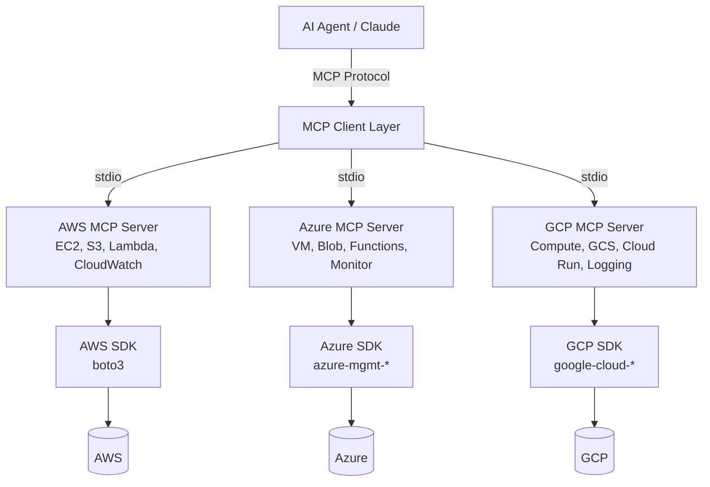

AI agents that operate across multiple cloud environments face a coordination problem: AWS APIs, Azure Resource Manager, and GCP's client libraries each have different authentication models, response shapes, and error handling. Writing an agent that can reason across all three means either implementing adapters for every cloud or building a protocol layer that normalizes them.

MCP is that protocol layer. Build one MCP server per cloud, expose a consistent tool interface, and any agent can query and act across your entire cloud footprint without knowing the underlying API differences.

## The Architecture



The agent sees one consistent interface — `list_compute_instances`, `get_resource_costs`, `check_service_health` — regardless of which cloud the resources live on. Each MCP server translates that interface into cloud-specific API calls.

## AWS MCP Server

```python
# aws_server.py
import boto3
import json
from datetime import datetime, timedelta
from mcp.server import Server
from mcp.server.stdio import stdio_server
from mcp.types import Tool, TextContent, Resource
import asyncio

app = Server("aws-cloud-server")

def get_session():
    """Get boto3 session — credentials from environment or IAM role."""
    return boto3.Session()

@app.list_tools()
async def list_tools() -> list[Tool]:
    return [
        Tool(
            name="list_ec2_instances",
            description="List EC2 instances with their state, type, and tags",
            inputSchema={
                "type": "object",
                "properties": {
                    "region": {"type": "string", "default": "us-east-1"},
                    "state": {
                        "type": "string",
                        "enum": ["running", "stopped", "terminated", "all"],
                        "default": "running"
                    },
                    "tag_filter": {
                        "type": "string",
                        "description": "Filter by tag value (searches Name and Environment tags)"
                    }
                }
            }
        ),
        Tool(
            name="get_cloudwatch_metrics",
            description="Fetch CloudWatch metrics for a resource over a time period",
            inputSchema={
                "type": "object",
                "properties": {
                    "namespace": {"type": "string", "description": "e.g., AWS/EC2, AWS/Lambda"},
                    "metric_name": {"type": "string", "description": "e.g., CPUUtilization"},
                    "dimensions": {
                        "type": "object",
                        "description": "Metric dimensions e.g., {\"InstanceId\": \"i-1234\"}"
                    },
                    "hours": {"type": "integer", "default": 24},
                    "region": {"type": "string", "default": "us-east-1"}
                },
                "required": ["namespace", "metric_name", "dimensions"]
            }
        ),
        Tool(
            name="get_s3_bucket_stats",
            description="Get storage size and object count for S3 buckets",
            inputSchema={
                "type": "object",
                "properties": {
                    "bucket_prefix": {
                        "type": "string",
                        "description": "Optional prefix to filter bucket names"
                    }
                }
            }
        ),
        Tool(
            name="get_cost_estimate",
            description="Get estimated AWS costs for the current month by service",
            inputSchema={
                "type": "object",
                "properties": {
                    "group_by": {
                        "type": "string",
                        "enum": ["SERVICE", "REGION", "TAG"],
                        "default": "SERVICE"
                    }
                }
            }
        )
    ]

@app.call_tool()
async def call_tool(name: str, arguments: dict) -> list[TextContent]:
    try:
        session = get_session()
        
        if name == "list_ec2_instances":
            region = arguments.get("region", "us-east-1")
            state = arguments.get("state", "running")
            tag_filter = arguments.get("tag_filter")
            
            ec2 = session.client("ec2", region_name=region)
            
            filters = []
            if state != "all":
                filters.append({"Name": "instance-state-name", "Values": [state]})
            if tag_filter:
                filters.append({
                    "Name": "tag-value",
                    "Values": [f"*{tag_filter}*"]
                })
            
            response = ec2.describe_instances(Filters=filters)
            
            instances = []
            for reservation in response["Reservations"]:
                for inst in reservation["Instances"]:
                    tags = {t["Key"]: t["Value"] for t in inst.get("Tags", [])}
                    instances.append({
                        "id": inst["InstanceId"],
                        "type": inst["InstanceType"],
                        "state": inst["State"]["Name"],
                        "name": tags.get("Name", ""),
                        "environment": tags.get("Environment", ""),
                        "az": inst["Placement"]["AvailabilityZone"],
                        "launch_time": inst["LaunchTime"].isoformat(),
                        "private_ip": inst.get("PrivateIpAddress"),
                    })
            
            return [TextContent(
                type="text",
                text=json.dumps({"instances": instances, "count": len(instances)}, indent=2)
            )]
        
        elif name == "get_cloudwatch_metrics":
            region = arguments.get("region", "us-east-1")
            cw = session.client("cloudwatch", region_name=region)
            
            end_time = datetime.utcnow()
            start_time = end_time - timedelta(hours=arguments.get("hours", 24))
            
            dimensions = [
                {"Name": k, "Value": v}
                for k, v in arguments["dimensions"].items()
            ]
            
            response = cw.get_metric_statistics(
                Namespace=arguments["namespace"],
                MetricName=arguments["metric_name"],
                Dimensions=dimensions,
                StartTime=start_time,
                EndTime=end_time,
                Period=3600,
                Statistics=["Average", "Maximum", "Minimum"]
            )
            
            datapoints = sorted(
                [
                    {
                        "time": dp["Timestamp"].isoformat(),
                        "avg": round(dp["Average"], 2),
                        "max": round(dp["Maximum"], 2),
                        "min": round(dp["Minimum"], 2),
                    }
                    for dp in response["Datapoints"]
                ],
                key=lambda x: x["time"]
            )
            
            return [TextContent(
                type="text",
                text=json.dumps({"metric": arguments["metric_name"], "datapoints": datapoints}, indent=2)
            )]
        
        elif name == "get_cost_estimate":
            ce = session.client("ce", region_name="us-east-1")
            
            today = datetime.utcnow().date()
            start = today.replace(day=1).isoformat()
            end = today.isoformat()
            
            group_by = arguments.get("group_by", "SERVICE")
            response = ce.get_cost_and_usage(
                TimePeriod={"Start": start, "End": end},
                Granularity="MONTHLY",
                Metrics=["UnblendedCost"],
                GroupBy=[{"Type": "DIMENSION", "Key": group_by}]
            )
            
            costs = []
            for result in response["ResultsByTime"]:
                for group in result["Groups"]:
                    costs.append({
                        "group": group["Keys"][0],
                        "cost_usd": round(float(group["Metrics"]["UnblendedCost"]["Amount"]), 4)
                    })
            
            costs.sort(key=lambda x: x["cost_usd"], reverse=True)
            total = sum(c["cost_usd"] for c in costs)
            
            return [TextContent(
                type="text",
                text=json.dumps({
                    "period": f"{start} to {end}",
                    "total_usd": round(total, 4),
                    "by_group": costs[:20]
                }, indent=2)
            )]
        
        else:
            raise ValueError(f"Unknown tool: {name}")
    
    except Exception as e:
        return [TextContent(type="text", text=f"AWS Error: {str(e)}")]

async def main():
    async with stdio_server() as (read_stream, write_stream):
        await app.run(read_stream, write_stream, app.create_initialization_options())

if __name__ == "__main__":
    asyncio.run(main())
```

## Azure MCP Server

```python
# azure_server.py
from azure.identity import DefaultAzureCredential
from azure.mgmt.compute import ComputeManagementClient
from azure.mgmt.monitor import MonitorManagementClient
from azure.mgmt.costmanagement import CostManagementClient
import json
from datetime import datetime, timedelta
from mcp.server import Server
from mcp.server.stdio import stdio_server
from mcp.types import Tool, TextContent
import asyncio
import os

app = Server("azure-cloud-server")
SUBSCRIPTION_ID = os.environ.get("AZURE_SUBSCRIPTION_ID", "")

@app.list_tools()
async def list_tools() -> list[Tool]:
    return [
        Tool(
            name="list_virtual_machines",
            description="List Azure Virtual Machines with their power state and size",
            inputSchema={
                "type": "object",
                "properties": {
                    "resource_group": {
                        "type": "string",
                        "description": "Filter by resource group name (optional)"
                    }
                }
            }
        ),
        Tool(
            name="get_vm_metrics",
            description="Get CPU and memory metrics for an Azure VM",
            inputSchema={
                "type": "object",
                "properties": {
                    "vm_resource_id": {
                        "type": "string",
                        "description": "Full Azure resource ID of the VM"
                    },
                    "hours": {"type": "integer", "default": 24}
                },
                "required": ["vm_resource_id"]
            }
        ),
        Tool(
            name="get_azure_costs",
            description="Get Azure costs for the current month grouped by service",
            inputSchema={
                "type": "object",
                "properties": {
                    "group_by": {
                        "type": "string",
                        "enum": ["ServiceName", "ResourceGroup", "ResourceLocation"],
                        "default": "ServiceName"
                    }
                }
            }
        )
    ]

@app.call_tool()
async def call_tool(name: str, arguments: dict) -> list[TextContent]:
    try:
        credential = DefaultAzureCredential()
        
        if name == "list_virtual_machines":
            compute_client = ComputeManagementClient(credential, SUBSCRIPTION_ID)
            resource_group = arguments.get("resource_group")
            
            if resource_group:
                vms = list(compute_client.virtual_machines.list(resource_group))
            else:
                vms = list(compute_client.virtual_machines.list_all())
            
            result = []
            for vm in vms:
                instance_view = compute_client.virtual_machines.instance_view(
                    vm.id.split("/")[4],  # resource group from resource ID
                    vm.name
                )
                power_state = next(
                    (s.display_status for s in instance_view.statuses 
                     if s.code.startswith("PowerState/")),
                    "Unknown"
                )
                result.append({
                    "name": vm.name,
                    "resource_group": vm.id.split("/")[4],
                    "size": vm.hardware_profile.vm_size,
                    "location": vm.location,
                    "power_state": power_state,
                    "os": vm.storage_profile.os_disk.os_type,
                })
            
            return [TextContent(
                type="text",
                text=json.dumps({"vms": result, "count": len(result)}, indent=2)
            )]
        
        elif name == "get_azure_costs":
            # Azure Cost Management API
            from azure.mgmt.costmanagement.models import (
                QueryDefinition, QueryTimePeriod, QueryDataset,
                QueryGrouping, QueryAggregation
            )
            cost_client = CostManagementClient(credential)
            
            end_date = datetime.utcnow()
            start_date = end_date.replace(day=1)
            
            group_by_dimension = arguments.get("group_by", "ServiceName")
            
            query = QueryDefinition(
                type="ActualCost",
                timeframe="Custom",
                time_period=QueryTimePeriod(
                    from_property=start_date,
                    to=end_date
                ),
                dataset=QueryDataset(
                    granularity="None",
                    aggregation={
                        "totalCost": QueryAggregation(name="Cost", function="Sum")
                    },
                    grouping=[
                        QueryGrouping(type="Dimension", name=group_by_dimension)
                    ]
                )
            )
            
            scope = f"/subscriptions/{SUBSCRIPTION_ID}"
            result = cost_client.query.usage(scope, query)
            
            costs = []
            for row in result.rows:
                costs.append({
                    "group": row[1],
                    "cost_usd": round(float(row[0]), 4)
                })
            costs.sort(key=lambda x: x["cost_usd"], reverse=True)
            
            return [TextContent(
                type="text",
                text=json.dumps({
                    "period": f"{start_date.date()} to {end_date.date()}",
                    "costs": costs[:20]
                }, indent=2)
            )]
        
        else:
            raise ValueError(f"Unknown tool: {name}")
    
    except Exception as e:
        return [TextContent(type="text", text=f"Azure Error: {str(e)}")]

async def main():
    async with stdio_server() as (read_stream, write_stream):
        await app.run(read_stream, write_stream, app.create_initialization_options())

if __name__ == "__main__":
    asyncio.run(main())
```

## Configuring Multiple Servers for an Agent

With both servers built, configure them in Claude Desktop's config or your agent's MCP client:

```json
{
  "mcpServers": {
    "aws": {
      "command": "python",
      "args": ["/path/to/aws_server.py"],
      "env": {
        "AWS_DEFAULT_REGION": "us-east-1",
        "AWS_PROFILE": "production"
      }
    },
    "azure": {
      "command": "python",
      "args": ["/path/to/azure_server.py"],
      "env": {
        "AZURE_SUBSCRIPTION_ID": "your-sub-id",
        "AZURE_TENANT_ID": "your-tenant-id"
      }
    }
  }
}
```

Now the agent can compare EC2 costs against Azure VM costs, query both clouds for running instances, and identify where workloads are running — all with natural language.

## Using MCP Servers from Your Own Agent Code

You're not limited to Claude Desktop. Use the MCP Python SDK to connect programmatically:

```python
from mcp import ClientSession, StdioServerParameters
from mcp.client.stdio import stdio_client
import asyncio
import json

async def query_cloud(server_script: str, tool_name: str, arguments: dict) -> dict:
    """Call a tool on an MCP server and return the result."""
    server_params = StdioServerParameters(
        command="python",
        args=[server_script],
    )
    
    async with stdio_client(server_params) as (read, write):
        async with ClientSession(read, write) as session:
            await session.initialize()
            
            result = await session.call_tool(tool_name, arguments)
            
            # Parse the returned text content
            text = result.content[0].text
            try:
                return json.loads(text)
            except json.JSONDecodeError:
                return {"raw": text}

async def multi_cloud_cost_summary():
    """Compare costs across AWS and Azure for the current month."""
    
    # Query both clouds concurrently
    aws_task = query_cloud(
        "aws_server.py",
        "get_cost_estimate",
        {"group_by": "SERVICE"}
    )
    azure_task = query_cloud(
        "azure_server.py",
        "get_azure_costs",
        {"group_by": "ServiceName"}
    )
    
    aws_costs, azure_costs = await asyncio.gather(aws_task, azure_task)
    
    return {
        "aws": aws_costs,
        "azure": azure_costs,
        "aws_total": aws_costs.get("total_usd", 0),
        "azure_total": sum(c["cost_usd"] for c in azure_costs.get("costs", [])),
    }

result = asyncio.run(multi_cloud_cost_summary())
print(f"AWS this month: ${result['aws_total']:.2f}")
print(f"Azure this month: ${result['azure_total']:.2f}")
```

## Cross-Cloud LangChain Agent

Wire the MCP servers into a LangChain agent using the `langchain-mcp-adapters` package:

```python
from langchain_mcp_adapters.client import MultiServerMCPClient
from langchain_anthropic import ChatAnthropic
from langgraph.prebuilt import create_react_agent

async def run_multi_cloud_agent():
    async with MultiServerMCPClient(
        {
            "aws": {
                "command": "python",
                "args": ["aws_server.py"],
                "transport": "stdio",
            },
            "azure": {
                "command": "python",
                "args": ["azure_server.py"],
                "transport": "stdio",
            },
        }
    ) as client:
        tools = await client.get_tools()
        
        llm = ChatAnthropic(model="claude-sonnet-4-6")
        agent = create_react_agent(llm, tools)
        
        result = await agent.ainvoke({
            "messages": [{
                "role": "user",
                "content": (
                    "Compare our infrastructure costs on AWS vs Azure for this month. "
                    "Which cloud is more expensive, and what are the top cost drivers on each? "
                    "Also check if we have any stopped EC2 instances we're still paying for."
                )
            }]
        })
        
        return result["messages"][-1].content

import asyncio
response = asyncio.run(run_multi_cloud_agent())
print(response)
```

The agent automatically gets all the tools from both servers and can orchestrate queries across clouds in a single conversation.

## Design Principles for Multi-Cloud MCP Servers

**Consistent tool names across clouds** — if the tool that lists VMs is called `list_virtual_machines` on Azure and `list_ec2_instances` on AWS, the agent has to know which cloud has which. Instead, add a cloud prefix to tool names (`aws_list_instances`, `azure_list_instances`) or keep names consistent across all servers when the operation is conceptually the same.

**Normalize response shapes** — return the same field names for the same concepts (e.g., always `{"name": ..., "state": ..., "size": ..., "region": ...}`) so the LLM can compare results without knowing cloud-specific field names.

**Credentials from environment, not code** — MCP server processes inherit environment variables from the host. Keep credentials in environment variables or IAM roles, never in the server code.

**One server per cloud per concern** — don't build one giant server for everything. A compute server, a storage server, and a cost server per cloud are easier to maintain and reason about than a single 2000-line server.

## Key Takeaways

1. **MCP normalizes multi-cloud APIs** — build consistent tool interfaces; hide cloud-specific SDK differences inside the server
2. **Multiple MCP servers can run concurrently** — one per cloud, one per service domain, connected simultaneously
3. **`asyncio.gather()` on multiple servers** — query AWS and Azure in parallel with the MCP client SDK
4. **`langchain-mcp-adapters`** — wire any MCP server into a LangChain/LangGraph agent in a few lines
5. **Credentials from environment** — MCP processes inherit env vars; never hardcode credentials in server code

---

*Part of the [MCP Deep Dive series]({{ site.baseurl }}/tags/mcp-series/) — building production-grade integrations with Model Context Protocol.*
